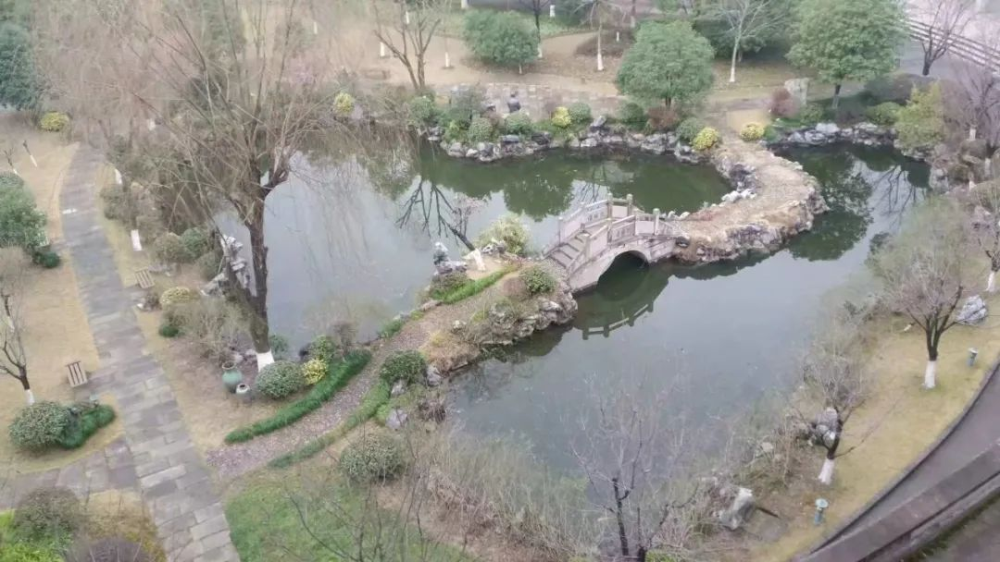

“如果我们一同被人梦见，那便是我们的相逢。”

日光鼎盛，雨却与红墙奏成和弦，泠泠瑟瑟。回忆的细屑被雨点激起。

你曾在那个命定的夏天与她相遇，或者说那个夏天也因此代表了命运。在这里梦开始被编织，然后落地成为具象的未来。

你念诵着“立志、努力、为公”，最初你试着朗读，然后便成为了它们。当你一次次拖着行李走过，它借由校碑看着你的侧脸，和你问好或者告别。

你听懂了第一句唱词前的弦乐声，然后将校歌唱响，从中偷出一句音符便是一首长诗。你学会了一个又一个晦涩的成语，并把它们写进你的座右铭。

你会看见校前空阔的广场，想象某个春天，陌生的面孔和笑声曾把它加热和填充，那时的少年曾像郁金香一样盛放，毫不吝啬成为青空的花火。

你在树阴下游走，路过赤子钟和半隅球场。你回忆起年年不同的敲钟仪式和所有洒落在这里的欢笑。

报时声命定般响起，邱低沉优雅的嗓音赋予确定的幻想，而在响起前它总给你隐秘的期待。你错把三刻的铃声当作三十分，于是气喘吁吁地伴着全班同学的倒数声匆匆打卡签到。

你见识过逐渐睡去的操场，在高三逃掉一整个晚自修孤身前往。散落的光像碎片，你看到它踩着点渐渐渗入黑暗，然后绕着它一圈一圈的慢行。你熟悉每一寸褶皱，也曾在这里收获了匆匆的爱情。在走过每一段没有灯的路时，你都暗念她的名字，试图点亮心里的光。

你也曾是凌晨食堂的常客，携着重难点或是单词书排在清晨六点的长队上，完成一天最圆满的开始。放下书包开始晨跑，杂错的光终于被时间理成一缕一缕的整齐，像素描的排线全然平行。彼时音乐开始响起，并非什么以动衬静，这歌声确乎撕碎了最后一丝黎明。

后来你学会了懒惰，学会将卡交给室友，学会将蛋黄派交给早读。你奔跑过每一条走廊，试图找到从寝室到教室最短的路途，然后悄悄溜进后门。

你会想起最初做贼一样的寝室夜聊到最后肆无忌惮的熬夜学习，你会想起寝室里的魔方乒乓球扑克牌麻将Kindle和狼人杀，你会悄悄打量今天值班的大伯来决定整晚的计划，会兴奋地分享今天偷听到的八卦。你有这样一些室友，他们同睡一张床却不感到拥挤，同吃一碗泡面却不感到寒酸，半夜组排和学习的竟也是同一群人，寝室的小板凳一到晚上便自动排列成狼人杀局的圆桌模样。

慢慢你喜欢去图书馆占得一个座位，这是你最早接触却最晚爱上的地方。你总是习惯性地四周眺望，想要觅得一些意外和谈资，未果后才颓然地坐回旁桌早已为你占好的座位。

你说你喜欢碎心湖胜过一切，缓缓的淳佑桥和匆匆的竺廊将她环绕。她是存在于每一个二中人心中的精神坐标。她在喧嚣中沉默，在人来人往中超然存在，你经由她得知季节的变换，终于发现，散在水中的落花是春风的阴谋，桂花开了又谢是秋天的骗局。

而当登顶二中之巅的时候，你猜测着每一个缩写的姓名，也好奇每一条留言的背后，接着你也提起笔，泼洒出你所有的希冀与遐想。那日天幕的灯盏被城市古老的光拢成沉寂的火红，如同婆婆皲裂的皮肤在夕阳的映衬下透出光辉，这是属于你的自由。
你靠着她成就了一些事，再长的纸也难以罗列下来。二中摇动的是你的灵魂，她让自由和自主扎根，以丰富和多元将你包装，而并不贪婪某一种虚名。

你借由她的标签加入了许多人，不论是朝夕相伴还是素昧平生。你是二中人，并由衷地为你的名字自豪，在这里有太多出色的同学和老师，以至于经常产生自己也是其中一员的错觉，但你终究是了。你回想起一些闪回的片段，那是每一个慵懒而昏昏欲睡的午后，每一行书写又擦去的板书，每一次负疚又利索的作业抄写，每一杯贝纳颂，每一支百乐笔，每一本书，每一张脸。你于是明白，有些事情需要显得漫长，那是为了不留遗憾。

你是资历最新而又最老的一届二中人。你历经食堂二楼三年菜谱的变迁，从铁板牛排到日式肥牛饭。 你看着一个个社团从无到有，看着一个个俱乐部由小变大。你看过桂花开了又谢，看过小卖部旧貌换新颜。你懂得了一切的事物从未在既定的轨道上走远，却每每能奇异地完成了圆满的苟且。

却总有一些事物是不变的，你在贴着红墙行走，于是看见那堵红墙带着的青苔和藤蔓，这是不被时间洗涤的痕迹，是你所有人生追求的萌芽。你在二中度过的那一千天还嵌在每个砖瓦缝隙里，被红墙铭记。开始这面红墙便是你的梦想，后来却成为追逐下一个梦的倚靠。

现在是她的生日了，由你来代表她真正的年纪。你提笔写下古典的三行情诗却又一字字删去，爱总难以被简单地素描成文字。你赶在对她的回忆异化成想象的前面,尽力将闪回过记忆的一切碎片记录下来，留下所有带着她气息的物件。但我想她知道你的爱了，也会听见你所有的祝福。

也许你没有如期归来，但那也正是离别的意义。当雨点再次打到脸上，你意识到，这些在你回忆里发生的事，真正结束了，而在你面前逐渐展开的新的红墙，也从此开始了。