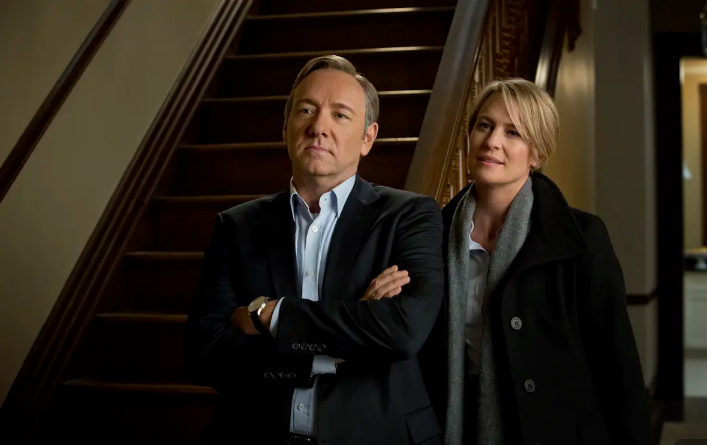

作为一部完结于2013年前后的美剧，《纸牌屋》作为一部以美国政治斗争为背景的剧，改编于Michael Dobbs的同名政治小说。它事实上向当时处于高三的我相对完整地展示了美国政治的运行逻辑。国会中两党的互相制衡，议员们为了保住自己的选区进行政治交易，资本押注政治不间断地利益输送，幕僚和媒体明争暗斗。年少的我欣赏这幅图景，看男主弗兰西斯·安德伍德（Franscis Underwood）不择手段地操作棋局，利用人性的同时却又蔑视它。在这里不讨论剧外Kevin Spacey的个人问题，单纯从演技来说，我认为他完美的诠释了一个老练而残忍的政客。纸牌屋一共六季，最近几周开始重新从头刷起，但这次只看到第三季中途就再难看下去，可能是心绪上对下木和克莱尔（Claire）夫妇从第一和第二季的互相依靠到第三季的背叛和解耦有些难以接受。也有对下木当上总统后在对外外交、国内选举和家事上同时有些技穷的悲哀。以下从豆瓣摘要了一到三季大致的剧情：

## 剧情

### 第一季

经过数轮激烈角逐，新一届美国总统加勒特·沃克诞生，自称水管工的众议院多数党党鞭弗兰西斯·安德伍德在其背后功不可没。然而高傲自大的政客弗兰西斯并未如愿当上国务卿，他为此恼怒不已，发誓要将背叛了自己的沃克拉下宝座。利用新总统拟推的综合教育改革法，弗兰西斯操纵《华盛顿先驱报》女记者佐伊·巴恩斯大做文章。初战告捷，他旋即指派手下对新政府展开新的围剿，同时巧妙化解躲避来自政敌的明枪暗箭。他犹如来自伊甸园的毒蛇，巧舌如簧，翻云覆雨，紧紧咬住所有人的弱点，以实现自己的目的。“没有永远的敌人，只有永远的利益”，这句话在弗兰西斯身上得到最佳体现。

### 第二季

上一季结尾，弗兰西斯·安德伍德的真实目的逐渐显露出来，老谋深算的他有条不紊将副总统的职位攫到自己手中，并着手扶持杰姬·夏普竞选党鞭，展开对总统加勒特·沃克的全面围捕。生活中，弗兰克对克莱尔温情脉脉，夫妻二人的关系升华到新的阶段。而对于胆敢威胁到自己的人，他则毫不留情地予以抹杀，即便是曾亲手调教出来的佐伊·巴恩斯，一旦羽翼丰满妄图振翅高飞，也只有丧身殒命，成为可悲的政治牺牲品。

### 第三季

经过煞费苦心的钻营设计，弗兰西斯·安德伍德如愿坐上总统宝座。但在他执政的半年时间里，民调支持率一路走低，而其强硬专横的执政风格也在党内外备受争议。为了成功赢得2016年大选，弗兰西斯力推精心打造的《美国就业法案》笼络人心。此外，和俄罗斯接二连三的较量中，他步步为营，小心周旋，却也不免壮士断腕。克莱尔雄心勃勃，试图在联合国一建功勋，夫妇俩携手出征的过程中渐行渐远。受了重伤的道格被迫闲赋在家，他始终关注弗兰西斯的动向，时刻渴望回到幕僚团队。在更大的政治利益或者政治理想面前，每个人都不得不做出惨烈的牺牲，以迎接即将到来的蜕变。

## 评论

从较高语义的层次讲，这部剧由事业和家庭两条主轴贯穿，相辅相成。在政治斗争的事业上展现了彻彻底底的实用主义者眼中世界的残酷本质，这也是剥除了温情笼罩后世界本来的面貌。政治是一个关乎交换和平衡的游戏，是社会达尔文主义的最好践行场景。而在以夫妻关系为核心的家庭关系上，对于某种人，一段稳固而长久的婚姻基于且只能基于理想和野心，而不能以爱情。而安德伍德夫妇的反目和互相背叛也非世俗的感情或经济纠纷。在第一季中，安德伍德因为政治需要半包养了一名年轻有为的女记者，但这一事事实上是被克莱尔默许的。而当克莱尔面临情感需要时，前去寻找老情人亚当·嘉乐维，但在安德伍德需要帮助时毫不犹豫的回到他身边。这是一种近乎残忍的价值观，但至少有一点是普世的，那就是坦诚。事实上，两人关系的恶化也是从谎言开始的。作为联合国大使，克莱尔偶发的仁慈和任性破坏了安德伍德的外交计划。时任总统的安德伍德展现了他自私的一面，夫妻间曾维护的共同利益破碎而重铸成了对维护总统宝座本身的野心。但并不是所有人都是毫无道德感的，人与人之间的联系，既靠利益，也靠情感和共同的价值观。极端地强调实用和功利主义，也只能聚集一批以利相交而惟利是图的人。批判地看待剧中人物的价值观，在理性时用冷漠武装自己却又不失温情，永远有理想和野心。

## 摘抄

1. 痛苦分两种，一种让你变得更强，另一种毫无价值，只是徒添折磨，我对没价值的东西也没耐心。
2. 对我们这类人来说，勉强生存与死无异。
3. 一个人的品行，不取决于这人如何享受胜利，而在于这人如何忍受失败。
4. 对自由世界最有权势的人说不，可不容易。但有些时候，要想赢得上司的尊重，就只能违抗他。
5. 别低估了慷慨的力量。
6. 我必须残忍，因为我不能失败。我要对自己残忍，我得利用恐惧。他让我变得坚强。
7. 没有秘密，我们就不是自己。毕竟，我们多少只是我们选择表现出来的样子。
8. 求回报的善举只是伪善。
9. 凭感情做的决定不叫决定，那是直觉。
10. 只有一条规矩，不做猎物，便为猎人。