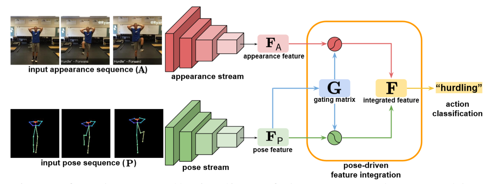
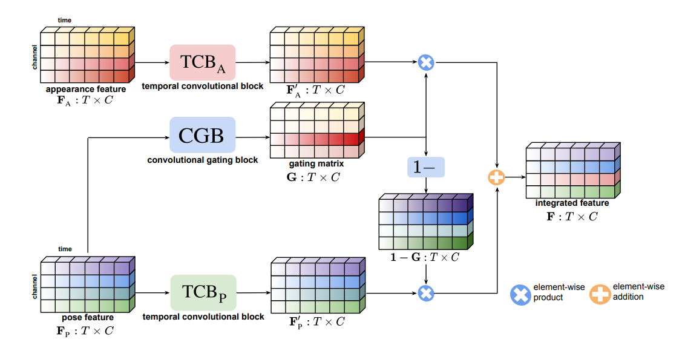

[CVPR 2021] IntegralAction: Pose-driven Feature Integration for Robust Human Action Recognition in Videos

大多当前的动作识别方法直接依赖于RGB视频的输入(appearance)；也有部分首先使用姿态预测(pose)，再将人体姿态作为输入训练分类网络形成two-stage的方法。然而，直接融合这两种思路存在一定的困难，联合训练具有appearance和pose的模型最终会产生很强的appearance bias，并且不能很好地泛化到新的domain。因此，本文提出由pose驱动的动作识别网络，其核心是将pose这一高级语义作为辅助信号，使用门控单元控制appearance和pose两个stream的融合权重，最终效果达到了SOTA。

在appearance stream中，作者使用Resnet作为backbone，结合temporal shift module (TSM)来提取特征。TSM将在之后的笔记中详细叙述。在pose stream中，作者直接使用已有的2D姿态估计网络。在fusion前，两个stream都是独立pre-train过的，而在fusion时，两个预训练好的模型被冻结。fusion时，只使用pose feature去产生门控矩阵，并且是一种soft的权重，然后直接对两个stream分别做element-wise product并且相加，最终得到融合的feature。

论文思路近似attention，但区别在于只使用了pose的部分去产生权重，而不是整体拼接后采用自注意力机制。作者对比了不同的融合方法和做了完整的消融实验，在Kinetics，Mimetics和NTU-RGBD上都取得了不错的结果。作者后续对pose-driven和appearance-driven，预训练和冻结权重的问题也展开了实验和讨论，也是我觉得本文足以入选oral名单的精彩环节。这些问题只有在精度论文时才会有想到思考，并且在论文读至这部分时有种被答疑和补全的感觉，能说明个人论文阅读的水平确实有点长进了。

> pose-driven vs. appearance-driven
> 作者发现在环境信息较混乱(out-of-context)的场景下，appearance-driven表现不好，并且both-driven也会强烈偏向对于环境的理解而产生偏差。相对的，pose只提供人体的动作信息，相对来说有更好的泛化性能，能适应不同环境下的数据输入，是一种较高层次的语义特征。

> pre-training and fix
> 作者展示了pre-training和fix结合的实验效果，并且认为这样做能够尽可能地保留两个stream原本的独立特征，这也是本文所一直倡导的观点。

最近要考试周，心不够静，先看两天论文，论文的主题涵盖：

1. 无监督的域自适应 unsupervised domain adaptation
2. 人体姿态估计 human pose estimation
3. 单目深度估计 monocular depth estimation
4. 人体动作识别 human action recognition
5. 多模态学习 multimodal learning
6. 视频对象分割 video object segmentation
7. 高分辨率语义分割 high-resolution senmentic segmentation
8. 多任务学习 multi-task learning
9. 有监督的深度图补全 depth completion
10. 轻量级网络结构单元 light module
11. 深度学习下的分子生成 molecular generation for deep learning