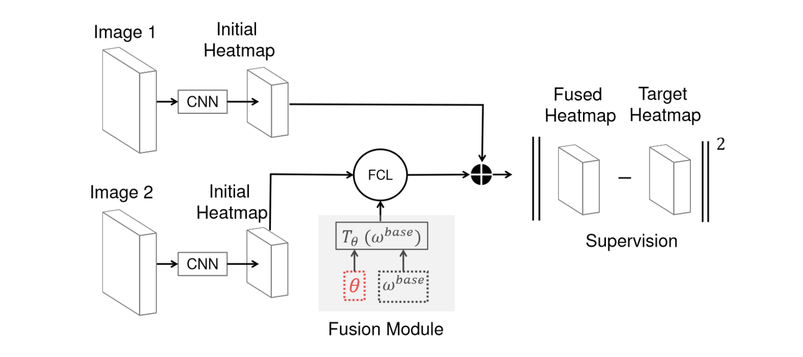
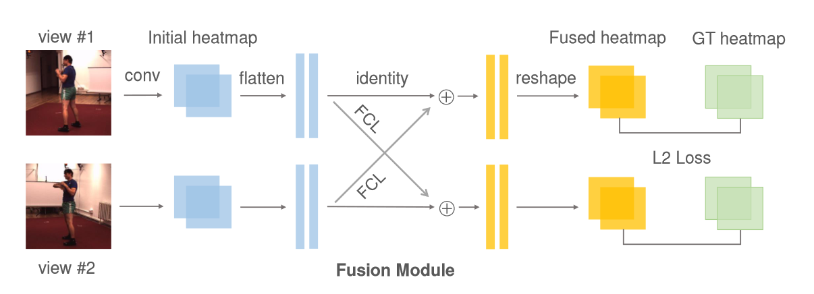
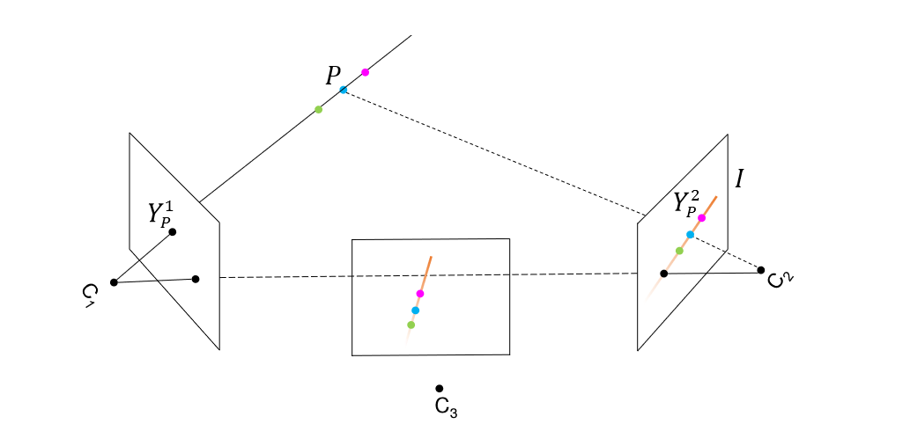
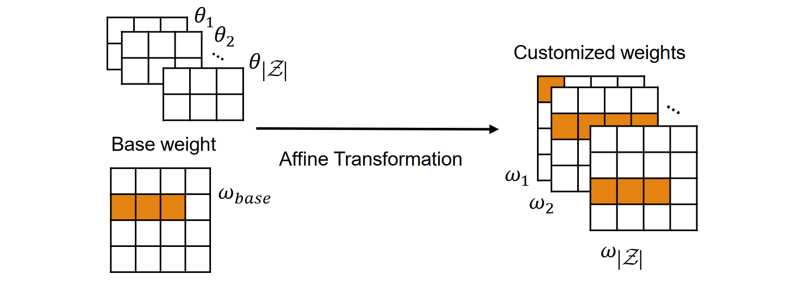
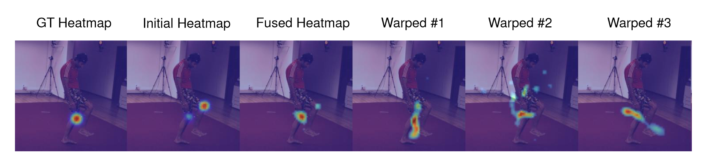
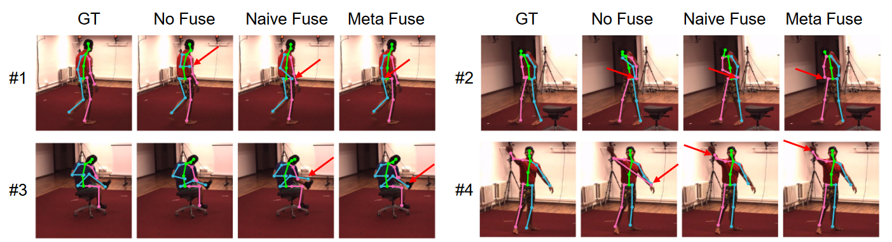

[CVPR 2020] MetaFuse: A Pre-trained Fusion Model for Human Pose Estimation

这是一篇信息量较大的文章，在四门考试期间读完它实属不易。传统的人体姿态估计模型对于视角极为敏感，笔者的血泪经历也证明很难在不同视角的domain间做finetune。作者将元学习引入多视角的人体姿态估计任务中，通过将特征提取、跨视角融合权重、视角变换三者解耦，有效降低参数量以此大幅提升泛化性。方法的场景设定是具有一个rich的source domain和一个few labeled的target domain。三阶段的训练策略也使得这一模型在few-shot learning方面有卓越的表现。

如上图所示，在使用encoder提取不同视角的2D heatmap之后，最简单的方法是直接采用全连接层的方式来融合一个相机对之间的信息。如下图所示，将视角1中的Heatmap拉伸为一维向量，然后经过全连接层转换后与视角2的初始Heatmap相加，即可得到视角2的最终预测。但是，全连接层简单地将一个视角中的所有像素，和另一视角中所有像素相连接。它的参数对位置的敏感性高，当相机姿态稍微变化时就可能急剧改变。因此，该方法很难迁移到不同的多相机环境中。此外，全连接层的参数量较大，在小数据量训练的情况下存在过拟合的风险，泛化性较差。

如上图所示的几何关系。$Y_P^1$是一个视角下的2D keypoint，由于缺乏深度信息，在另一张heatmap中，其可能所对应的点构成了一条epipolor line $I$。通过将这条线上的特征信息加权聚合到原视角，就能很好的对单一视角的特征信息做出补全。在最理想的情况下，可以理解为单眼不能确定深度，双眼光线交点就能够唯一的确定一个点的深度位置。

由于存在这样的几何关系，我们只需要一个通用的fusion matrix $w_{base}$，用来表示视角1中一个像素和视角2中所有像素间的连接关系。以及一组视角间仿射变换参数（2x3的矩阵），就能够很好的适应不同相机对的特征融合。对于矩阵的仿射变换，参考Spatial Transformer Networks论文所阐述的内容。Spatial Transformer Networks是一篇不亚于ResNet的天才级想法，可以让网络自由学习到除了平移不变性以外的更加多样的空间特征。关于这篇文章的解读有很多，是不可不读的一篇文章。

由此，作者把多视角姿态检测的网络解耦成了三个模块，即特征提取、跨视角融合权重、视角变换。并以元学习的风格制定了三个阶段的训练策略。**首先**，使用单视角的数据充分训练特征提取网络，并在后续阶段冻结权重。**其次**，使用大量不同视角的相机对充分训练视角融合权重和视角变换参数，这一部分是使用元学习风格的，通过将不同相机对的数据当作不同的task，期望学习到更加通用的参数。**最后**，在实际应用在少样本的目标域时，冻结特征提取和融合阶段的权重，而只finetune视角变换的参数，这一参数量是很少并且很specific的，因此很容易收敛。最终在实验中获得了SOTA的结果。

本文采用了解耦的元学习训练策略，充分利用了人体姿态任务的独特性，使用几何的先验关系分离了模块，降低了参数量，解决了视角转移中泛化难的问题，是一篇思路清晰的论文。