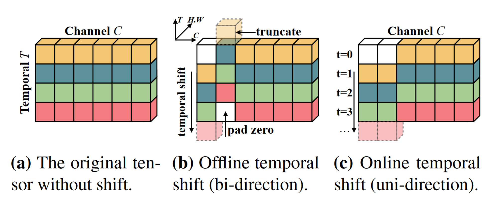
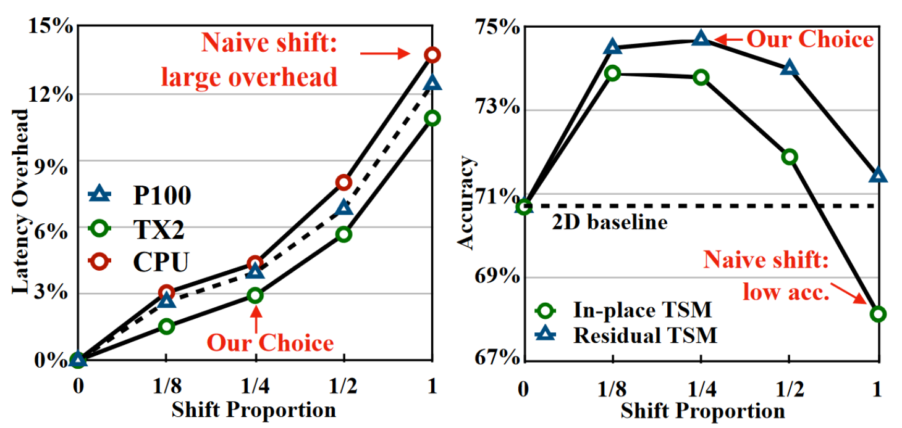
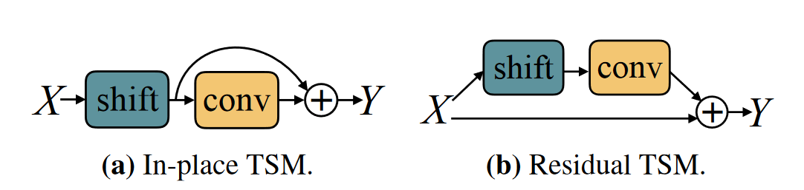

[ICCV 2019] TSM: Temporal Shift Module for Efficient Video Understanding

## Introduction

2D CNNs已经被证明是图像理解领域的重要架构之一。卷积的操作既有效捕捉了图像中像素间的空间信息，又适配于大规模的并行计算，更能通过层的堆叠和组合捕捉特征图中更高层的语义特征。视频是由逐个帧的图像构成的，自然也可以沿用处理图像的思路。不同的是，如果使用2D CNNs逐帧提取图像特征很难捕捉到视频中帧的时序信息。自然的想法是将2D CNNs推广到3D CNNs，将卷积层的维度扩展到时间上，以此捕捉到帧间的相互关联。然而不幸的是，3D CNNs虽然能很好的提取时序特征，但是效率实在过低，不仅在推理速度还是显存占用上都存在不小的问题。本文因此提出了Temporal Shift Module，试图在2D CNNs的运算效率上实现3D CNNs的精度。

如上图所示，TSM的核心思想是将一部分特征沿着时间维度进行平移，使得在一次2D CNNs的操作中可以包含多个帧的拼接特征。思想简单但是有效。但能从顶会论文中学到的不仅是一个闪光的思想。如何将这个思想落地也是本文探究的重点。

## Discussion

### Shift Proportion

一个重要的超参数选择是shift的特征比例，0代表完全不shift，1代表全部shift（产生的结果是特征集体错位了一帧）。左图说明，shift proportion越大，效率上的开销也就越大。右图说明并不是shift proportion越大越好，事实上，1/4这个值是实验上最合适的，本文认为更大的proportion会直接破坏网络对单帧空间上的建模能力（因为缺少足够量的特征）。

### In-place or Residual

为了更进一步的保留网络对单帧空间上的建模能力，借鉴ResNet的思路，进一步提出将TSM作为残差模块接入。实验上也说明了使用Residual形式比In-place具有更好的性能，同时也更方便的即插即用了。

## Conclusion

本文提出的贡献简单有效，即插即用，原理简单，实验明确。希望自己以后写论文的时候也要遵从这个思路，抛弃一些莫名其妙的卖点，抓住一个work的小点充分展开，才能成为一篇好论文。