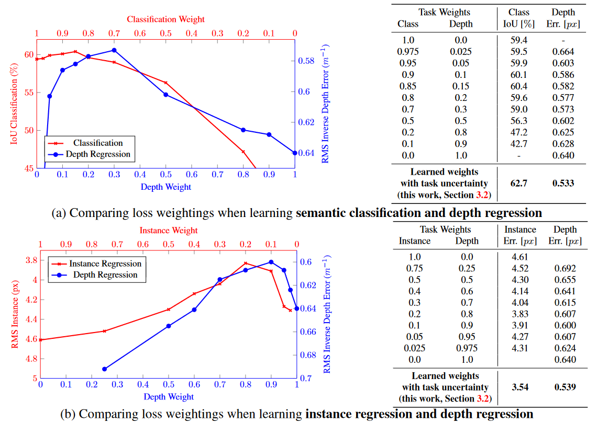

[CVPR 2018] Multi-Task Learning Using Uncertainty to Weigh Losses for Scene Geometry and Semantics

## Introduction

多任务学习是深度学习领域中的重要概念。通过不同子任务的互相约束，可以使网络减少归纳偏置、帮助收敛、提取共性特征来取得更好的性能。一个最简单的多任务组合架构形式是共享一个Encoder，而对不同子任务设计不同的decoder。本文的重点放在多任务损失函数的建模上，通常来说，多任务的损失函数是由各个子任务的损失函数加权求和形成，其中不同任务的权重的确定是一个重要的命题。人为搜索最佳的权重不仅费时费力，而且缺乏可解释性，如下图。

本文将应用场景设置在场景理解上，设定Sementic Segmentation，Instance Segmentation和Depth Regression三个子任务。值得注意的是，这三个子任务的选择不仅本身有高价值，更重要的是，其中语义分割是Semantics的任务，深度回归是Geometry的任务，而实例分割同时涉及这两者。因此这样的子任务设计涵盖了场景理解的两个不同的两个重要方面，并且跨越了分类和回归两种不同的输出形式，使得本文的工作更有价值。

## Discussion

本文的重点在基于不确定性确定多任务权重。首先定义不确定性，这部分我主要从《What Uncertainties Do We Need in Bayesian Deep Learning for Computer Vision?》这篇论文和[这篇博客](https://leijiezhang001.github.io/paperreading-MT-Learning-Using-Uncertainty-to-Weight-Losses/)中学习。

本文讨论同方差不确定性，其描述了不同任务间的相关置信度，所以可用同方差不确定性来设计不同任务的Loss权重项。这里强烈吐槽微信公众号冥顽不灵，不加公式编辑接口导致十分难受，只能直接上截图。

## Experiment

本文是我即将投入精力尝试复现的论文，因此对实验部分需要仔细确认。Encoder部分使用的是DeepLabV3的架构，ResNet101的backbone。Decoder部分是简单的反卷积和上采样。对于Sementic Segmentation使用交叉熵作为损失函数，对于Depth Regression使用深度倒数的L1距离作为损失函数，这是方便描述无穷远的深度。使用的数据集是CityScapes，2975张作为训练集，500张作为测试集，分辨率为2048×1024（但是后面跑的时候直接降到了256×128）。

## Conclusion

本文说明了根据不确定性确定的多任务损失函数权重相比单一任务和人为设定的权重有更好的表现。