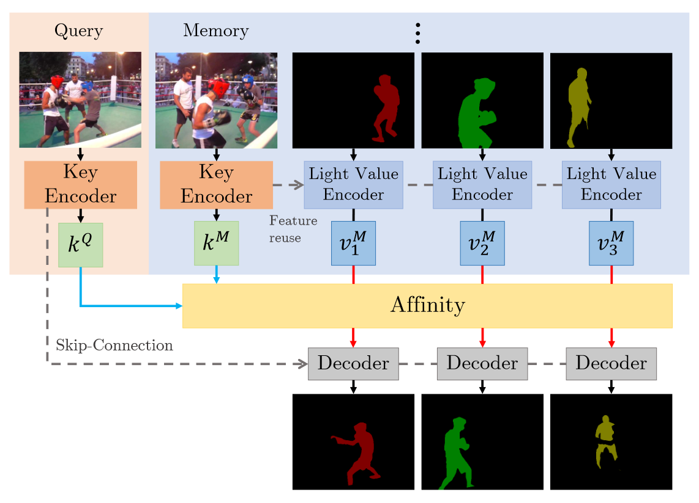
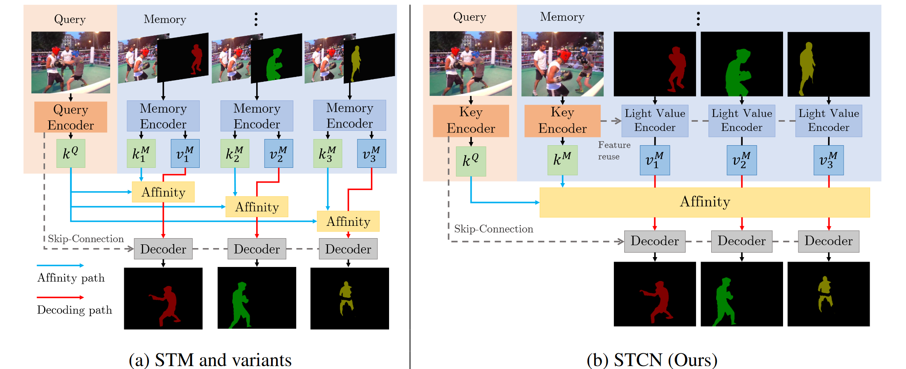
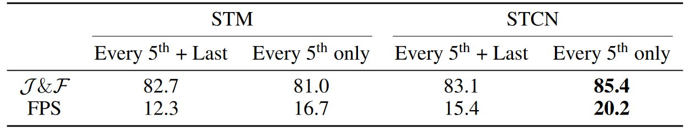

[NIPS 2021] Rethinking Space-Time Networks with Improved Memory Coverage for Efficient Video Object Segmentation

## Introduction

首先来定义semi-supervised的Video Object Segmentation (VOS)任务：给定一段视频序列和第一帧的分割mask，推理全序列的实例分割。目前主要的处理思路是构建memory network，把每一帧的特征与第一帧做匹配，通过encoder-decoder的设计范式。其中最有影响力的工作是STM，它为video中的每一个object的key建立memory bank，然后对每一帧产生query从而匹配。更高层次的看，semi-supervised VOS可以被看作一个少样本学习问题。

## Discussion

### Feature Extraction

本文提出的STCN相对STM最大的贡献在于高效性上。左图为STM的pipeline，右图为STCN的pipeline。STM对query和memory分别设计encoder，对query只使用image输入，而对memory使用image-mask pair输入，对每个object生成key-value对。而在STCN中，query的encoder生成key，但在memory中生成统一的key和分离的value。需要注意的是，这个key encoder对于帧是共享的，因此可以直接使用上一帧的输出值，这也减少了计算量。并且key feature的计算不依赖于mask。

在STCN中，key encoder的backbone是ResNet50而value encoder用ResNet18。这是一个细节，因为mask的语义层次比image更高，因此不应用较深的网络。

### Memory Reading and Encoding

在decoder部分STM和STCN是一致的，都是通过相似度匹配以后把对应的key-value对经过上采样恢复到原尺寸的mask。

### Memory Management

对每个memory frame，存储它的两个信息：memory key和memory value。为了节省内存，构建memory的方式并不是每一帧的key和value都进行存储，而是每五帧储存一次。作者还设计了一个对比实验来讨论是否要每次使用前一帧作为memory对下一帧进行匹配，结果是仅仅使用每五帧的固定memory反而表现更好。作者当面的解释是相邻帧之间可能有很大的相似度，这导致memory bank的其他部分表现不佳。我的理解是过于依赖上一帧的信息会导致一定的bias而没有自我矫正的能力了。

### Computing Affinity

常见的三种计算相似度是dot product，cosine similarity和L2平方倒数。论文最终选择L2平方倒数作为相似度衡量的标准，这一点作者本人认为是被审稿人问的最多的问题之一。作者当面给我的回答是这样的：首先cosine similarity被排除，因为它不考虑两个特征向量之间的模长，这等于抹去了一个重要的信息，是十分愚蠢的；其次dot product使得大模长向量更加显著，导致在matching的时候，几个小模长向量与这个大模长向量的点积难以区分开来。作者认为相似度匹配的时候重要的一点是将正负样本分开，而不是聚拢。

## Conclusion

看完论文产生最大的疑惑是，这样key-query匹配的做法是否过于离散了，即太少考虑到时序一致性的问题。我甚至怀疑如果随机的打乱帧顺序构成新video，模型的结果也不会变差。作者也支持我的想法，并在思考一些新思路去解决这一问题。

致谢论文作者Rex Cheng的面对面答疑，祝他实习顺利。最近读的论文都和项目进度强相关，汇报分享两不误嘛。最近尝试把音频序列加入其中，尝试完善论文中时序约束不足的问题。再列一遍论文涵盖领域和waiting list，如果有推荐的论文也可以直接私信推给我看。

1. 无监督域自适应
2. 自监督3D人体姿态识别
3. 多任务语义分割
4. 无监督视频动作异常识别
5. 多模态视频对象分割
6. 知识蒸馏

Waiting List

1. Multi-Task Learning Using Uncertainty to Weigh Losses for Scene Geometry and Semantics
2. Source-Free Domain Adaptation for Semantic Segmentation
3. [?] Regressive Domain Adaptation for Unsupervised Keypoint Detection
4. [?] Decoupled Knowledge Distillation