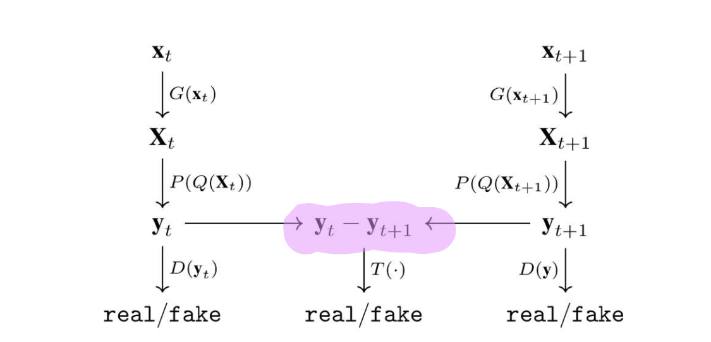

[CVPR 2019] Unsupervised 3D Pose Estimation with Geometric Self-Supervision

## Introduction

对于3D的人体姿态估计，常用的方法是two-stage的，即先训练一个从图片或视频的RGB流中估计2D关键点，再训练一个lifting network，将2D的关键点提升到3D。整个流程有很多可以讨论的地方，如自底而顶和从上至下的2D关键点估计方法的区别，还有直接从RGB流中估计3D关键点。在这里只讨论将2D提升到3D的部分。

首先需要说明的是，3D人体姿态数据集的制作成本很高，并且大都在室内场景下，这类数据集中最大最全面的是Human3.6M。但2D人体姿态数据集的制作却相对容易，这也是为什么3D人体姿态估计任务通常被设计成two-stage的原因——end-to-end的训练数据太稀少并且fixed。基于这个痛点，一个重要的研究方向是是用弱监督甚至自监督的方法来从2D坐标提升到3D，并且与域自适应结合。其目的在于对于一个未标注的任意视频中推断相对准确的结果。

本文提出了一个以几何约束为自监督信号的网络设计，应用于单视角，单帧的流输入情况。文章中也提出了一种添加temporal consistency的方法，这被证明是有效的。

## Discussion

### 2D-3D pose mapping的两个性质

#### 1. Closure
   
如果2D姿态能被精确的提升到3D，那么在随机的旋转之后，2D的坐标仍然在分布内，然而3D的坐标则会变的很不精确。

#### 2. Invariance

一个3D姿态的不同视角的2D映射，在经过lifting network之后，仍然会输出相同的3D姿态。

结合以上两点性质，本文提出的框架如上图所示。在寻找几何一致性的过程中，首先是对输入的2D姿态提升到3D，再对3D的姿态做随机变换，映射回2D.再对新的2D坐标提升到3D，逆变换后再映射回2D。在流程结束后，2D和3D的姿态一致性都被考虑进损失函数中。这个思想有一些类似于循环一致性，是一种将几何先验知识教给神经网络的好方法，和数据增强本质上是一致的。

### 2D姿态判别器

本文中设计了一个基于神经网络的2D的姿势判别器对随机变换后投影的2D姿态进行评估。作者发现在不添加这个判别器的时候，输出的姿态是满足几何要求的，但看起来不是真实的。作者使用标准的GAN去训练这个部分。判别器向lifting network提供反馈，使其能够学习3D骨骼的先验知识，例如仅肢体长度和关节角度的比率。

### 时序一致性

在时序一致性的判别上，作者也使用GAN的风格，将两帧的运动轨迹加入判别器，输出一个置信度。这一部分是存有疑惑的，作者并没有对方法进行完整的说明和实验。

### 域自适应

关于域自适应，作者设计了GAN风格的2D姿态适应网络，用来将target domain调整到source domain上。这一部分同样存有疑惑，这样的网络只能调整例如关节定义等语义上的差别，但对于不同视角的2D坐标没有充分说明能够适应。而域自适应的最大需求之一我认为是视角的不同，这一块也需要再重新考虑。

## Next Step

有关下一步的工作，作者认为使用auto-encoders或其他无监督的方法对已有的大规模数据集进行补全和扩充，使用端到端的域自适应和lifting network可能成为这项任务的一个方向。