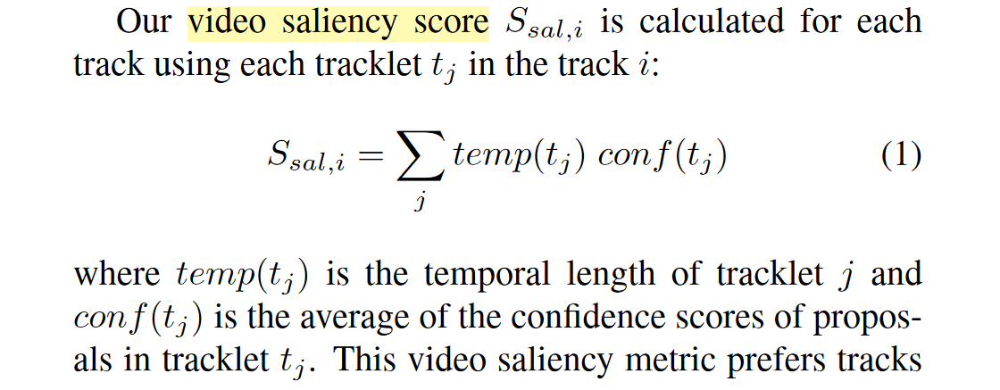

[CVPR 2019] UnOVOST: Unsupervised Offline Video Object Segmentation and Tracking

## Introduction

无监督的视频对象分割注重于视频中的显著性物体，而不基于任何的标签输入。显著性被定义为"the objects that catch and maintain the gaze of a viewer across the video sequence"。定性地说，有两个重要的判断因素，第一是物体在场景中的静止或者运动具有一致性，第二是物体可以被一致地被语义分割。在文末有一个公式来衡量：

这一项任务的重要应用是在机器人和自动驾驶汽车领域，其中能够理解大量物体的精确位置和运动是至关重要的，这些物体的类别远远多于任何标记的数据集。

本文提出的框架是一个多阶段的无监督视频对象分割算法，并且不限于对象的类别、运动或静止、处于背景或前景。其中不仅有基于深度学习的特征学习技术，还有基于匈牙利匹配和决策树的经典机器学习算法。具体来说，这三步分别为：

1. 对每一帧提出候选的目标，并利用阈值进行初步筛选。
2. 根据帧间的掩码交并比使用匈牙利算法进行帧间匹配，形成小的tracklet。
3. 根据掩码物体的外观相似度设计Re-ID算法，对长时间段的tracklet进行拼接。

## Object Mask Proposal Generation

作者使用在COCO80个类别上预训练的Mask R-CNN逐帧的对场景进行语义理解。这个阶段的网络输出有掩码、框框、物体类别和置信度。文中设定置信度阈值为0.1鼓励生成80类之外的物体检测。经过这一阶段之后会存在一些问题，如下图所示：

对于这种重叠的情况，基于交并比和置信度，使用类似NMS非极大值抑制的方式来获得不相互遮挡的分割掩码来进入下一阶段。

## Tracklet Generation

Tracklet是同一个对象在时序上的一段连续轨迹。上一阶段是逐帧的信息提取，但是帧间的匹配情况是未知的。在本文中，Tracklet生成是基于时空一致性的。具体来讲，是通过计算相邻帧之间的IoU，过滤掉一些过于低的IoU（文中是0.05），随后构造二分图使用匈牙利算法进行最优匹配。

## Merging Tracklets into Tracks

Track和Tracklet有所不同，它需要关注一整个视频中相同的对象，而非一段连续的序列。也就是说，它需要处理同一个对象在视频的中间帧消失后又重新出现的情况。整个流程图如下：

因为并不打算改进这一部分的算法，在这里简单叙述一下思路。对于每一个在第二阶段提出的tracklet，根据appearence计算用于Re-ID的特征向量，使用L2距离衡量两个特征向量之间的相似度。特征向量的计算是一个appearance embedding network，这是一个在COCO上使用triplet-loss预训练的能够分辨COCO中不同类的网络。相似的tracklet被拉近，不同的被拉远。

## Final Tracks Selection

作者认为对一个视频中的显著物体的数量进行限制是有必要的，因此根据在Introduction中介绍的显著性分数计算进行排序，只挑选前20个最显著的物体进行评估。

## Ablation of the method

在消融实验上，本文主要进行的超参选择，结果如下。首先是第一阶段置信度阈值，显然过高或者过低的阈值都是不合理的。其次是时空一致性的tracklet生成阈值，发现在trainset和valset上很重要，但testset上很重要（不知道为什么，可能和DAVIS数据集的分布有关，毕竟规模不是很大）。在融合的策略上，匈牙利算法也展示出同样的结果。最后，在所有set上，第二阶段的merge是影响最大的，也是可以重点思考进一步提升的部分。

## 笔者理解下的改进方向

1. 只是简单的使用pretrained模型来推理，可能可以利用一些监督信号来自适应。
2. 使用低置信度来鼓励源域分布外的类别检测有一些强行，但暂时没有一个很清晰的改进思路。
3. 在设置判定阈值的时候依赖于人为经验的确定，可能可以适合于被推理的视频置信度的实际情况来适应。
4. 在设置时序一致性的时候基于相邻帧的交并比，本质是单帧推理，可能可以在这一阶段设计基于高维时序的Encoder来统一特征提取和时序生成阶段。
5. 引入光流或音源等多模态信号进行辅助推理，或者自监督的约束。