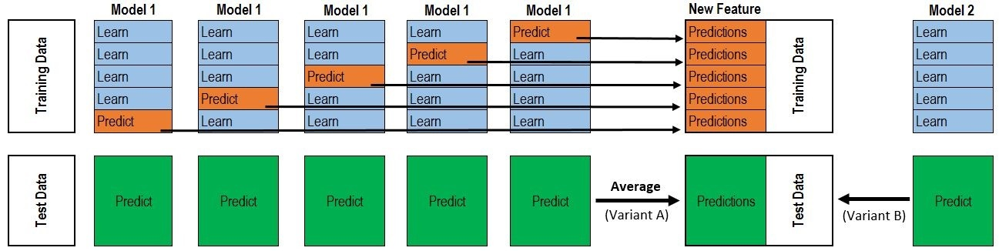

在科研的时候，一个更好的performance往往使得idea更有说服力，尤其是在刷榜打比赛的时候，总有一些trick是不得不用来内卷的。本文主要介绍了方便用于深度学习的一些集成学习的方法以及自己的一些想法和方向。

我将集成学习分为data-based和model-based。

## Data-based

基于数据的集成学习主要有两种，bagging和boosting。

bagging是使用单一种类模型在多源（或者人为划分）的数据上取得更好效果的办法。其主要思想是将训练集人为的划分成多个，或者是原来就存在多源的数据，在每一个子集上训练一个子模型。在验证集上，综合每个子模型的输出来得到最终预测。这样做的一个好处显然是减少overfitting和domain gap。

`举例：刷浙江卷、江苏卷、湖南卷、广东卷，最后去考全国卷。`

bagging的效果和数据集的性质紧密相关，在分布一致的数据集上不会有很好的效果。

`举例：4月1号考多邻国、4月3号考多邻国、4月5号考多邻国，最后考托福。`

boosting是传统机器学习中的一个重要手段。区别于bagging人为的将数据集划分，boosting是让被训练的模型自己对数据集进行刻画。具体来说，在训练时，模型不仅根据预测值和真实值的差值来进行自我更新，同时，模型错误预测的样本会获得一个更高的权重值，使得其在数据集中更加被强调。在下一轮epoch时模型对这些曾经分类错的样本产生梯度的强化。

`举例：把做错的题目拿错题本纠错，强化印象。`

boosting的效果和数据集的噪声紧密相关，在噪声多的数据集上不会有很好的效果。

`举例：纠错时，其实你做的是对的，答案就是错的，最后一错再错。`

## Model-based

基于模型的集成学习，我定义为多模型的综合预测策略，并将其分为多数投票法、平均法和stacking三种。区别于基于数据的集成学习，这些模型都是各自独立的在同一个数据集上被预训练好的。当然，这与基于数据的方法可以结合在一起使用，具体情况需要依据被选择的模型。总之，我们现在拥有了多个不同的模型，它们各自都对一个输入值产生一个输出，那么使用什么策略可以达到三个臭皮匠顶个诸葛亮的效果呢？

考虑这样一个二分类问题，我列出了以下一个情况：

`MODEL_A：1010110011`
`MODEL_B：1110100011`
`MODEL_C：1110110001`
`G_Truth: 1110110011`

可以看到，A B C三个模型对于真实值的预测都只有90%的预测成功率。但当我们使用多数投票法时，就能达到100%的正确率。
`MODEL_A：1010110011`
`MODEL_B：1110100011`
`MODEL_C：1110110001`
`Major_V: 1110110011`
`G_Truth: 1110110011`

实际上，在深度学习中，分类问题的模型输出值往往不会是0/1这样的硬标签，而是由sigmoid或softmax函数给出的一个置于0到1区间内的分类置信度。如网络输出0.8，说明网络认为有80%的概率属于这一种类。我们将各个网络的输出置信度值做一个平均，使用平均值作为最后的预测结果，也能得到比单一网络更好的结果，简单来说，这减少了单一网络预测时的噪声和不确定性。

看到这里，你已经掌握了一般人对于集成学习刷点的应用手段了，但是我想要阐述更多东西。我们知道深度学习的网络本质来说是一个特征的提取，对于分类任务而言，网络的最后几层将特征图拉平之后进入全连接层最后输出分类结果。所谓分类，实质上是指特征的匹配度和特征提取的有效程度。单一网络固然可以输出一个接近100%的置信度，但需要明白，对于分类问题，这个置信度是被标准化过的。也就是说，这事实上输出的是这一类相对于其余类的置信度。

`举例：一个模型只会识别猫和狗，当拿一头大象作为输入时，模型会认为其50%概率属于猫，50%概率属于狗。`

但事实上这是不对的，因为模型本身对这个分类并不肯定。如果有多个模型对这个大象进行预测，而其中大部分模型都在瞎猜，而真正的懂哥既不能通过多数投票证明自己，又会被淹没在平均值里面不能脱颖而出。

我们采取的策略是加权平均，也就是stacking。通过stacking的办法，我们让真正的专家脱颖而出，而不是由多数人掌握话语权。那么我们如何确定加权的权重呢？

我们从两个角度考虑，如果考虑一个固定的权重。对于一个数据集来说，确实存在一些模型的表现会高于其余有限的一些，那么他的判断自然会更加有可信度，根据实验我们能够确定模型预测的权值。这部分的训练框架基本上可以表示成如下公式。其中L是损失函数，w是可训练的权值，p是单模型的预测值，g是真实的标签值。

$loss = L (\frac{1}{K}\sum_i^K w_i p_i, g)$

但事实上，专家和笨蛋也是会互相转化的。对于大象的识别，模型A是专家，但到了人类的识别上，可能模型B有更靠谱的预测，因此一个固定的权重可能并不能起到一个好的结果。那么，我们能不能根据输入值，自适应的来改变权值呢，这听起来像注意力机制，也就是说，权值w可以被表示成`input`和各模型`output`的函数。

`举例：模型A对大象识别好，模型B对人类识别好。当进来一个物体时，首先根据物体的特征以及模型A和B的输出，来判断模型A和模型B哪一个更加可信，再赋予相应的权值。`

我正在进行这样的努力和尝试，也希望有想法的人能私信我沟通交流。