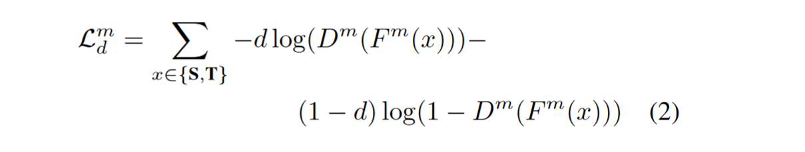
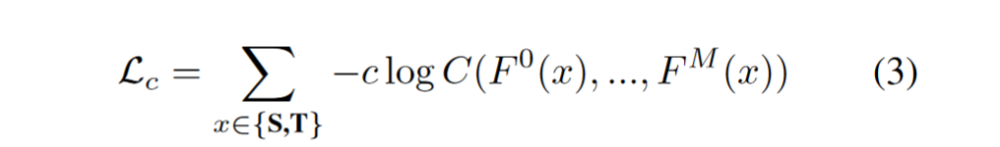

[CVPR 2020] Multi-Modal Domain Adaptation for Fine-Grained Action Recognition

## Introduction

深度学习在很多时候可以被认为是数据驱动的科学，大部分的情况下，神经网络的效果依赖于数据集的性质和分布。本文综合了域自适应和多模态的技术应用在视频行为识别上。要素虽多，但是方法上却很流畅简单，这不是一篇很具有创新性的文章，贡献主要在于证明了基于多模态的域自适应有很好的发展前景。

### 多模态（multimodal）

一段视频不仅仅由一帧一帧的图像构成，还有基于帧变换信息提取出的光流，视频本身的声音信号。这些不同来源的输入被称为多模态，本文主要关注RGB流和光流。

### 域自适应（Domain Adaptation）

同一个架构的神经网络，在不同的数据集上训练，表现也会不同。域自适应的任务是期望抹去模型在不同域之间的偏差。

`举例：模型A和B都是为了训练狗的图像识别。A数据集包含的全部都是草地上的狗，B数据集包含的全部是室内场景下的狗。由于提取图像信息的全局性，模型会关注整张图片上所有的内容。这就导致，在A数据集上训练好的模型A可能把草地也当作狗的特征，在推理B数据集上的图片时，会难以识别室内的狗。这就是domain gap。`

## Method

流处理图将算法的逻辑表达的很清楚，算法总共分为三个部分，分别以三种不同的损失函数来实现。

### Within-Modal Adversarial Alignment

在使用3D CNN提取各模态特征后，首先使用GAN定义的对抗损失，这是DA的经典手段。注意到本文中是各自做的损失，这样做的好处是可以避免域分类器在优化时只关注鲁棒性较弱的那个模态。

### Multi-Modal Self-Supervised Alignment

这是本文的重点，目的是在于根据模态一致性作为自监督信号进行训练。本文中设计了模态一致性判别器。在训练时正负样本的构造规则如下：

- 正样本：来自同一个动作不同时间段的多模态特征，即不一定要时序上对齐。
- 负样本：来自不同动作的多模态特征。

判别器达到的效果是判断两个模态是对同一个动作的表示，显然的，这可以进一步增强特征的表征能力。需要注意的是，这部分在推理是不进行的，只是用来帮助训练。

### Classification Loss

在有监督的情况下，可以融合两个流的预测进行回传，损失函数为三者的加权和，但整个模型仍然可以在无监督的情况下运作。本文在融合时简单的使用了average，这一点没有进一步的实验证明，有改进的空间。