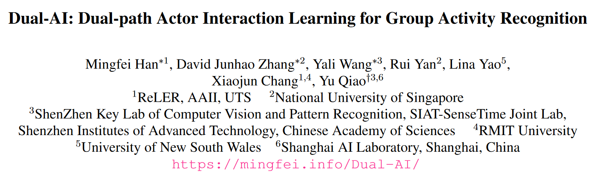
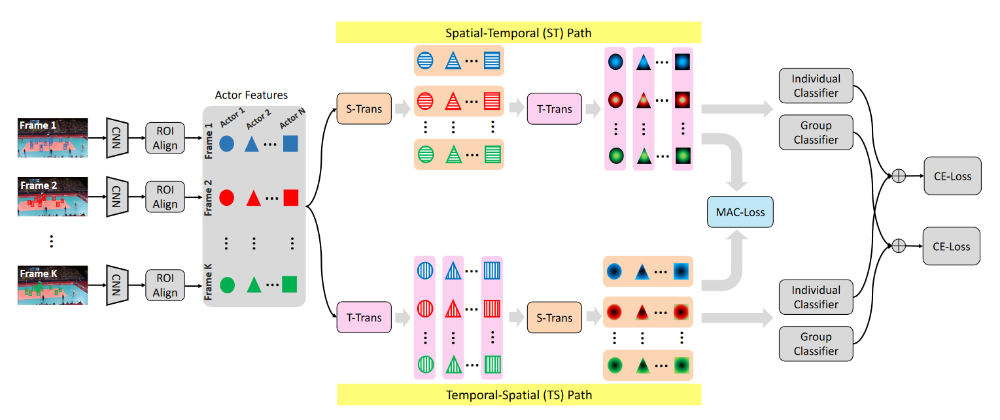
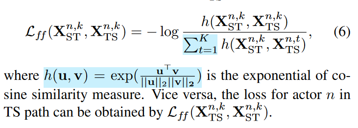
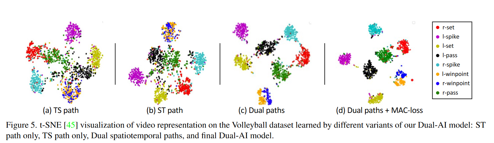

这篇入选了CVPR2022的oral，是近一个月来我阅读的很有创新的一篇文章。

## Introduction

Group Activity Recognition 是人类行为识别的一个子类，要求不仅识别每个人各自的动作模式，还需要给出整个群体的行为描述。一个经典的应用场景是多人体育竞技中，如排球、篮球、足球等。在这个任务中，或者说对任何多人的视频理解任务来说，如何捕捉时间和空间的关系（spatial-temporal relation) 是一个重要的问题，本文的贡献在于提出了一个双流的架构，以及基于双流的自监督约束损失，考察了frame-frame，frame-video，video-video三个不同层级的一致性。

## Dual-path

对于视频的输入，首先抽样其中的一些帧，再逐帧进入在ImageNet上预训练的Inceptionv3的backbone，随后经过RoIAlign得到bounding box中的特征，最后用全连接层得到逐帧逐人的特征。注意到这里的特征完全是不考虑到时空关系的独立特征。

论文的关键是对双流网络的设计，作者认为，考虑时序上的匹配和空间上的匹配分别适应了不同类型的行为。举例来说，spatial relation适合预测群体行为，而temporal relation更适合捕捉个体行为。基于这样的思想，作者对这两种不同的模式进行组合，交换了spatial和temporal的次序形成了双流网络。

网络具体的实现可以参考原论文的详细描述，在ST和TS中都是使用了位置编码和多头的自注意力机制，并以残差的形式连接。在模块间的耦合部分，S/T-Trans出来的特征会再进行一个非线性的MLP，再以残差的方式进入T/S-Trans。最后两个流分别通过分类器输出个体和群体的行为预测，通过平均给出最后的预测，并用交叉熵作为损失函数。

## Multi-scale Actor Contrastive Learning

在双流之间，本文设计了自监督的一致性损失函数。这里的multi-scale指的是标签层次上的多样性，即frame-frame，frame-video，video-video。

下面是对这个frame-frame损失函数的解读，对于一个流里单人单帧的特征，计算与同一个人在另一个流中的相同帧的特征的相似度作为分子，不同帧特征的相似度之和作为分母，最后取负对数。其中相似度是余弦相似度的指数，猜测是为了平衡数量级。

对于frame-video，video-video也是相似的,其中video的特征是对frame特征的简单pooling。整个训练是端到端的，不同损失函数加权求和，结果也是很好的。

