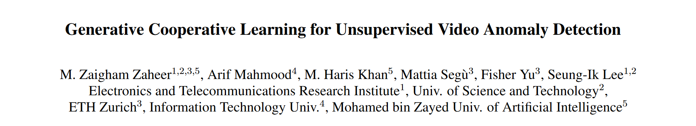
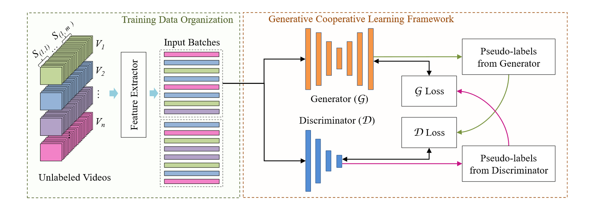
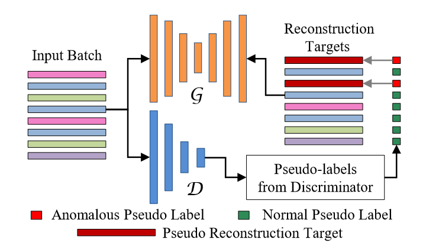
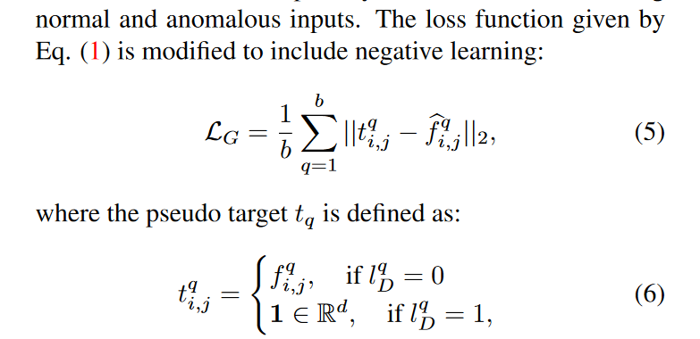

## Introduction

视频异常检测被认为是与正常数据的明显偏差。在openset的假定下，这一任务有两个重点：一是无真实标签，二是正负样本分布的极不均衡。

## Method



### Training Data Organization

将原视频切成不重复的等长切片，之后送入特征提取器，并且随机的打乱特征的时序顺序，这是与之前方法不同的地方。


### Generative Cooperative Learning

从架构上来说，生成器G是自编码器(AE)，理由是能捕捉数据集整体的主导情况；判别器D是全连接层(FC)，不容易被噪声干扰。训练过程是完全自监督的。从G创建伪标签用于训练D，接着，用被训练的D创建伪标签用于改进G，以此循环，是一个典型的GAN风格的训练方式。以下是具体方式。



### Generator Network (G)

G把第一阶段的特征作为输入，经过编码和解码进行重建(U-Net style)，并且简单设定了reconstruction loss为原特征和重建特征差的二范数。这里的思想是在于，对于大部分正常的样本，重建后的特征与原特征相差不大，但对于异常样本来说，会有比较大的改变，以此来训练一个分离正负样本的生成器。事实上本文也是这么做的，它简单地从实验经验设置了一个阈值，把超过这一损失阈值的打为异常样本作为伪标签。

### Discriminator Network (D)

D接受特征输入，二分类的判断正负样本，使用G给出的0/1伪标签做交叉熵。同样的，设定一个阈值来从D的预测给出0/1伪标签。需要说明的是，G和D的两个阈值设定都是根据batch的均值和方差动态调整的。伪标签被用来重新对G进行训练，训练的方式被称为Negative Learning。

一般的机器学习中使用的都是Positive Learning，即告诉网络真实的标签值。而Negative Learning想法，它告诉网络对于一个input的其中一个错误的标签值。

```
举例：Input：猫猫图片；
Positive Learning：这是猫；
Negative Learning：这不是狗
```

基于这个思想，虽然异常检测是一个二分类问题，但是对于损失重建来说，负样本显然比大量的正样本更有意义，于是更改损失函数如下，也就是在负样本的情况下，使用全1的特征向量替换原目标输出，以此期待网络对负样本的重建更加具有区分度。



### Self-Supervised Pre-training

本文训练的方式同样很复杂。由于异常检测是一个不明确的问题，缺乏约束可能会对收敛性产生不利影响，系统可能会陷入局部最小值。为了提高收敛性，考虑预训练G和D。其中预训练G更有利于学习系统的整体稳定性，它也提高了收敛性以及系统的性能。众所周知，自动编码器可以捕获训练数据的主导表征。尽管在训练数据中，异常情况是稀疏的，而正常情况是丰富的，但通过实验观察到，简单地利用所有的训练数据来预训练G可能并不有效。

本文对训练数据做了一定的清洗，尽可能的只用正样本进行预训练。在这一步中，G的作用类似于一个糟糕的老师，因为生成的伪标签是相当嘈杂的，而D的作用就像一个高效的学生，因为它学会了在嘈杂的标签下也能更好地分辨出正常和异常的特征。