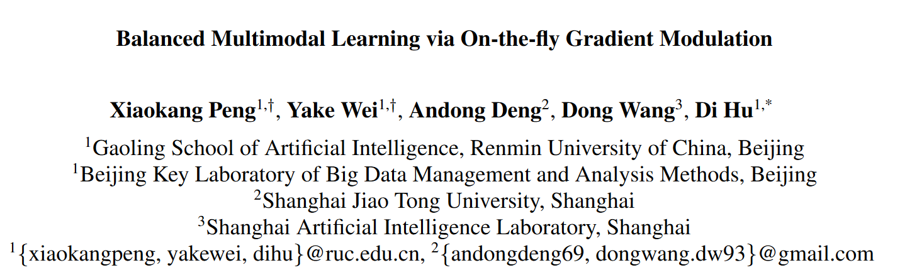

Title：Balanced Multimodal Learning via On-the-fly Gradient Modulation

Link：https://arxiv.org/abs/2203.15332

Project address (open source)：https://github.com/GeWu-Lab/OGM-GE_CVPR2022

## Introduction

之前已有相关的工作从数学上严格证明了多模态学习能够超越单一模态的上限（虽然我认为这一比较是不公平的，对齐的多模态数据天生有规模上量的优势）。但是对于不同任务来说，不同模态的置信度不同，含有的噪声也不同，在进行多模态学习中，这种不平衡的现象很容易造成模型偏向其中一个占据主导地位的模态。本文以concat的fusion方式为例，分析了造成这种现象的原因，并且提出了解决方案。这篇的笔记稍微写快一点，文章也比较简单，最近事情比较多。

## Method

### On-the-fly gradient modulation

文章主要从不同模态的梯度传播上入手，定义了一个量用于描述模态间差异比率。

其中k是分类任务中的类别，softmax里面的东西是各自模态encoder+linear层的输出类别预测。这里注意的地方是三点:
1. bias直接均分给两个模态各取一半了。
2. 比例中是vision作分子，audio作分母，因为vision通常比audio更可靠，并且是对一个batch进行求和更新的。
3. 论文里没有详细说明1_{k=y_i}的意思，推测是用onehot向量点乘softmax的概率向量，这就表明差异性只关注positive的预测。

根据这个比率来动态的调节不同模态的系数。

## Generalization enhancement

在调整梯度的过程中，实际上根据上方公式的调整策略，梯度只会减少不会增大。实际上根据SGD的理论，随机噪声对泛化性的提升是有帮助的。削弱梯度的时候同时也削弱了噪声，本文使用随机的高斯噪声作了回调。（那为什么不直接调整梯度更新的策略呢？）

## Experiments

指标不错，值得关注的一个消融实验是前文提到的差异系数的变化，实际上方法也只能做到减少，而不能消除，这是由于模态的特性导致的。

## Furthermore

其实在多模态学习领域里，模态间的融合方式不仅只有论文中所详细阐述的concat。融合的阶段也不一定要在各自模态的encoder提完特征后。在某些任务中，不同模态的地位是不相同的，分清主次模态也是一个方法，因此本文的做法有一定局限性，优点在即插即用，是一个很直观通用的工作。