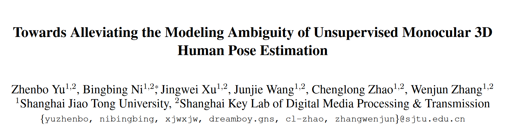

---
layout: post
title: "ICCV 2021 | 无监督单视角3D人体姿态估计中的不确定性建模"
author: "Reself"
categories: arXiv
tags: [unsupervised learning,human pose estimation]
image: HPE/overview.png
---`

## Introduction

来自ICCV2021的工作Towards Alleviating the Modeling Ambiguity of Unsupervised Monocular 3D Human Pose Estimation。本文针对了无监督单视角3D人体姿态估计中的不确定性问题进行了研究，整个工作直指本质，实验丰富，收获很大。这个Ambiguity主要在于两部分：

1. Scale ambiguity：在单视角中，如果没有别的约束，一个2D pose可以映射无数个不同scale的3D pose。
2. Pose ambiguity: 一个2D pose可以对应多个不同形状的3D pose，且都可能是合理的。

针对这两个问题，文章解耦了从2D到3D估计中scale和pose预测的模块，并分别设计了合理的损失函数和训练策略。

## Method

### Scale Estimation

相机成像的几何关系是一个简单的仿射变换，其中{x,y}是2D图像上的像素位置，{X,Y,Z}是相机坐标系下的3D实际位置，f是对应轴上的焦距，c是对应轴像素中心坐标。

$$
\begin{cases}
    x_i = \frac{X_i}{Z_i}f_x+c_x\\
    y_i = \frac{Y_i}{Z_i}f_y+c_y
\end{cases}
$$

本文指出，这个映射可以被用来定义被估计人体scale的大小。首先对2D pose简单中心化：

$$
\begin{cases}
    x_i := \frac{x_i-c_x}{f_x}\\
    y_i := \frac{y_i-c_y}{f_y}
\end{cases}
$$

显然这时就有$x_i=\frac{X_i}{Z_i},y_i=\frac{Y_i}{Z_i}$，继续作假设，同一个人的各个keypoint的Z轴深度相差不大，可以用同一个量$D$表示，论文中还对D的表示做了【归一化】，使得其是一个约等于1的数。给定所keypoint的3D和2D pose，由此定义scale为:

$$
    S = \frac{1}{2} [\frac{\mathcal{H}(\frac{X_i}{Z_i})}{\mathcal{H}(x_i)}+\frac{\mathcal{H}(\frac{Y_i}{Z_i})}{\mathcal{H}(y_i)}]
$$

其中$\mathcal{H}(x)=max(x)-min(x)$，表示所有keypoint对应函数取值中最大和最小的差。

在实际视频中，逐帧计算了scale后如下图AB所示，事实上是没有什么长期规律的，这是由人物在空间中的位置决定的。考虑把scale转变成频率图后，假定是一个正态分布，那么分布的方差和均值是可学的。

这部分使用KL散度作约束，希望prediction的scale能够贴近【GT】的distribution。

$$
\begin{align}
    \mathcal{L}_{kl} &= D_{KL}(\mathcal{N}(\hat{\mu},\hat{\sigma})||\mathcal{N}(\mu,\sigma))\\
    &=log \frac{\sigma}{\hat{\sigma}} +\frac{\hat{\sigma}^2+(\mu-\hat{\mu})^2}{2\sigma^2}-\frac{1}{2}
\end{align}
$$

但是由于分布的约束是被应用于整个domain上，不针对于单一的视频和单一帧，所以还应用了bone length的约束。约束应用于不同帧间，不使用额外参数。

$$
    \mathcal{L}_{bone}=||\mathcal{B}(J_{t_1}^{3D})-B(J_{t_2}^{3D})||^2
$$

总结第一部分利用时序尺度一致性的loss，并且加入L2正则化，

$$
    \mathcal{L}_{tsc}=\omega_{kl}\mathcal{L}_{kl}+\omega_{bone}\mathcal{L}_{bone}
$$

### Lifting Optimized 2D Pose to 3D Counterpart

这部分的大致思路和之前Unsupervised 3D Pose Estimation with Geometric Self-Supervision的工作一致，这篇的[阅读笔记](https://zhuanlan.zhihu.com/p/511027116)。大致是将2D pose提升到3D后进行旋转再映射回去，在这个过程中做自监督的映射差的loss，即：

$$
    \mathcal{L}_{2D}=||J_t^{2D}-\hat{J}_t^{2D}||^2,\mathcal{L}_{3D}=||J_t^{3D}-\hat{J}_t^{3D}||^2
$$

在旋转的时候需要对重映射的2D姿态进入判别器判断是否【合理】，这里没有用交叉熵来作为损失函数，而是对判别器和生成器（即lifting network）定义如下损失函数：

$$
    \min_{\theta_D}\mathcal{L}_{adv}(\Phi_D)=\mathbb{E}[\Phi_D(J_t^{2D})-1]^2+\mathbb{E}[\Phi_D(J_t^{R2D})]^2\\
    \min_{\theta_G,\theta_S}\mathcal{L}_{adv}(\Phi_G)=\mathbb{E}[\Phi_D(J_t^{R2D})-1]^2
$$

考虑到计算的效率，不同于之前的工作使用判别器进行时序约束，本文根据运动在不同视角下的统一性，提出了Multi-view Motion Consistency，即：

$$
    \mathcal{L}_{tmc}=||(J_t^{3D}-J_{t+k}^{3D})-(\hat{J}_t^{3D}-\hat{J}_{t+k}^{3D})||^2
$$

## Implementation

本文是解耦的两个模块，scale和pose，训练的方式是端到端的，但是实际上pose模块每训练4次后，才更新一次scale，各自训练时，另一模块的权重是冻结的，消融实验如下：

详细的超参数和训练过程在这里不再阐述，最后本文的结果是十分出色的，甚至接近了全监督的结果。

对于【Normalization】的处理也有对比试验

