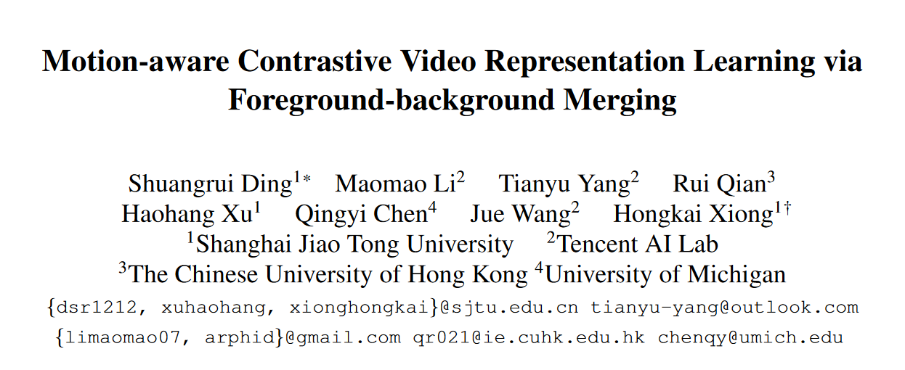
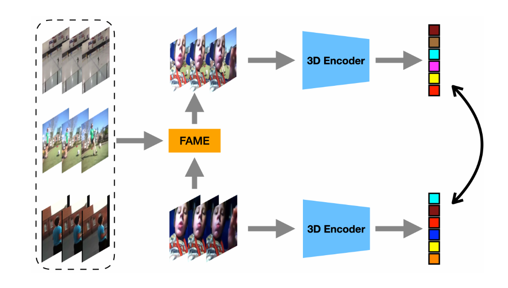

## Introduction

Motion-aware Contrastive Video Representation Learning via Foreground-background Merging

作者认为在视频理解的框架中，网络更倾向于学习静态的背景信息，这部分是因为这部分信息具有时序不变性。因此提出将运动的前景分离出来，并与不相干的背景融合。通过拉近处理前与融合后的特征，使得模型对于背景信息不敏感，且更关注于运动的前景。

## Method

*算法流程*

随机取两段视频，经过FAME框架后生成背景融合的正样本对，后续进行对比学习。

### Seed region

和光流类似，本文使用帧差法来捕捉运动前景的边缘。

$$
S = \frac{1}{T-1}\sum_{c=1}^C\sum_{t=1}^{T-1}||X_{c,t+1}-X_{c,t}||_1
$$

### Color distribution

为获得完整的前景掩码，使用color-based的方法。对于指定颜色$x$，定义其在前景出现的概率为其在前景的像素数除以总像素数，即$P(x|F)=N_x^{(F)}/N^{(F)}$。背景也是类似，有$P(x|B)=N_x^{(B)}/N^{(B)}$。在前景中选择50\%的区域，在背景中选择10\%，定义前景中颜色$x$出现的概率$P(F|x)=P(x|F)/[P(x|F)+P(x|B)]$作为soft segmentation，设定阈值从而转为二值掩码，完成分割。

## Discussion

本文对于分离运动物体、消除背景偏差的思路是很好的，可能可以结合因果推断进行进一步工作，但是简单的使用color-based不能很好的适应复杂的视频环境，