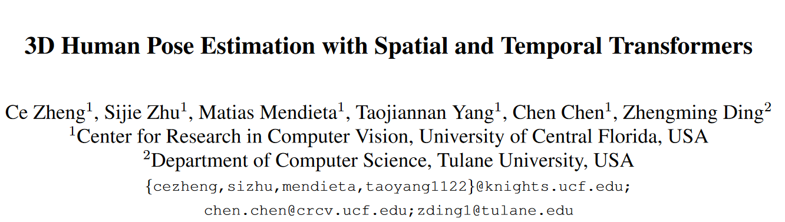
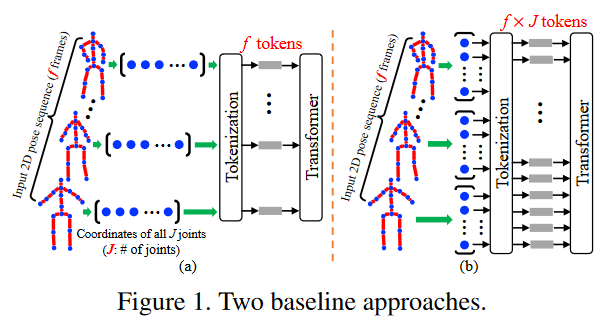
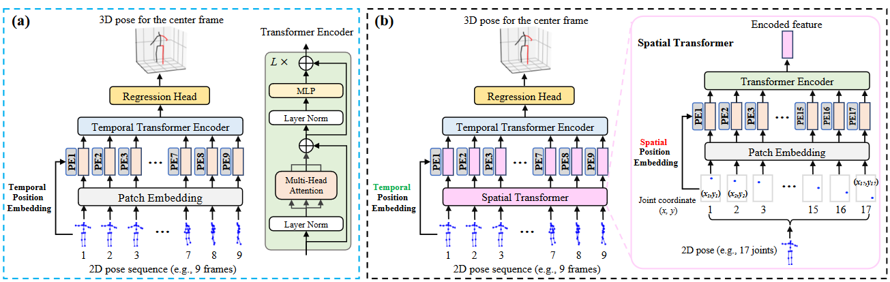

## Introduction

本文是第一篇纯使用Transformer架构进行3D人体姿态估计的工作，聚焦的部分是2D-3D lifting network的部分。是一篇朴实但有奠基性的文章。

## Method

文中针对transformer的架构提出了两种最简明的baseline，如下图所示。左图中将单人单帧的17个Joints作为一个token输入，以时序构建连接，但是坏处是不能对帧内的信息进行有效的互联。右图中把单人单帧的17个Joints作为17个tokens输入，这可以捕捉全局的时空约束，但是在运算上存在很大浪费（毕竟t时刻的头和t+1时刻的脚按理说也没必要有信息互通吧）。

于是本文设计的PoseFormer架构将空间关系和时序性两个部分解耦来建模。首先对单帧的输入经过Spatial Transformer，再拼接多帧的结果经过Temperal Transformer，最后进入单层的NLP输出结果。

整个流程的张量尺度变化为：
1. B x F x 17 X 2
2. B x F x 17 x C
3. B x 17 x C
4. B x 17 x 3