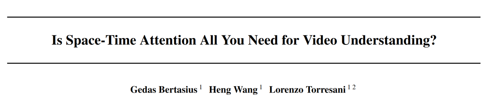
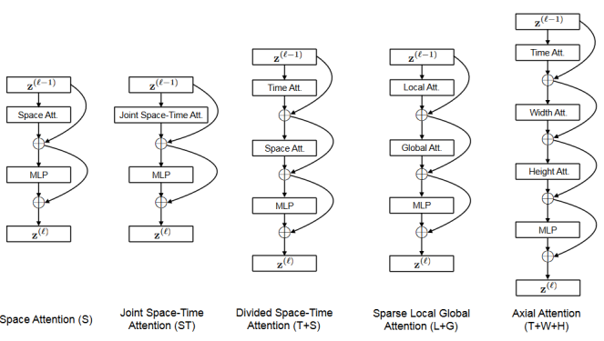
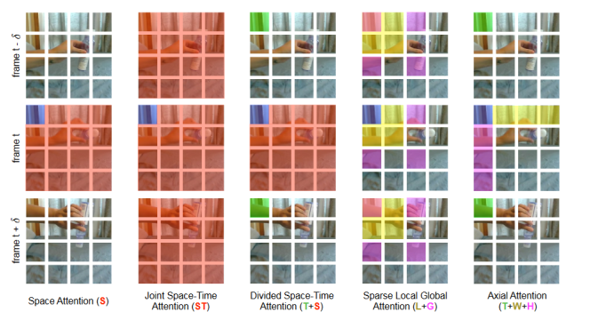
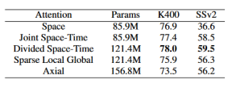
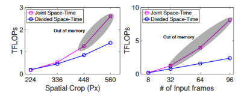
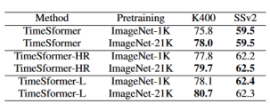
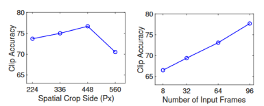

## Introduction

Is Space-Time All You Need for Video Understanding 

Transformer-based model 已经成为深度学习领域最热门的架构之一。自注意力机制的成功在于打破了传统卷积极强的归纳偏置和困难的全局连接困境。ViT将img分为patch的做法使得图像处理也能使用相似的手段构建token，而swin-transformer将卷积和transformer的优势结合起来，在交替的堆叠中取得更好的效果。本文的TimesFormer考虑了针对视频输入的设计。相比于图像输入，视频多的一维时间使得信息量更加庞大，如何有效利用这一维信息是本文探究的重点。
 
## Method

### Input clip

以下是一些记号的说明，input $X \in \mathcal{R}^{H \times W \times 3 \times F}$, H，W为宽高，F为帧数，3是三通道RGB。

### Decomposition into patches

Following ViT，将单帧图片以$P \times P$的size划分成$N=\frac{HW}{P^2}$个patch。对p位置，t时刻的信息，表示为$x_{(p,t)}\in \mathcal{R}^{3P^2}$。

### Linear Embedding

根据NLP的一贯做法，将输入信号先进行线性的embedding，并加上位置编码。$E$是一个$D\times 3P^2$可学习张量。

$$
    z_{(p,t)}^{(0)} = E x_{(p,t)} + e^{pos}_{(p,t)}
$$

### QKV and self-attention

略

### Spatial attention

对帧内的各个patch做self-attention。

### Temperal attention

对帧间同位置的patch做self-attention。

### Block combination

论文最核心的部分在于对不同形式的block组合的讨论，主要有五种。

1. Space Attention(S)：仅对帧内
2. Joint Space-Time Attention(ST)：对整体patch
3. Divided Space-Time Attention (T+S)：先对帧间，再对帧内
4. Sparse Local Global Attention(L+G)：2的简化版，差距不大
5. Axial Attention(T+W+H)：甚至把宽高视为两个方向

通过可视化图直观的展示对于蓝色区块的attention的作用域。最终option 3脱颖而出。

### Experiment

需要关注的主要是四组数据，第一是以上五种的效果：

第二是在计算的开销上：

第三是预训练的影响：

第四是输入信息量的影响：

