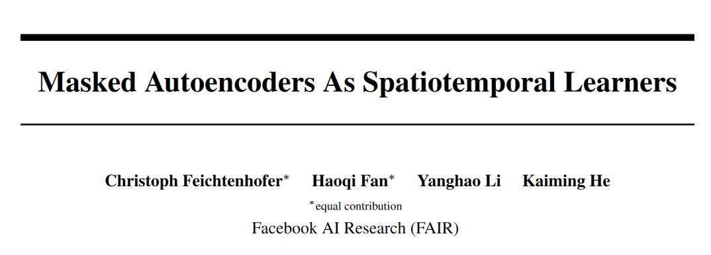
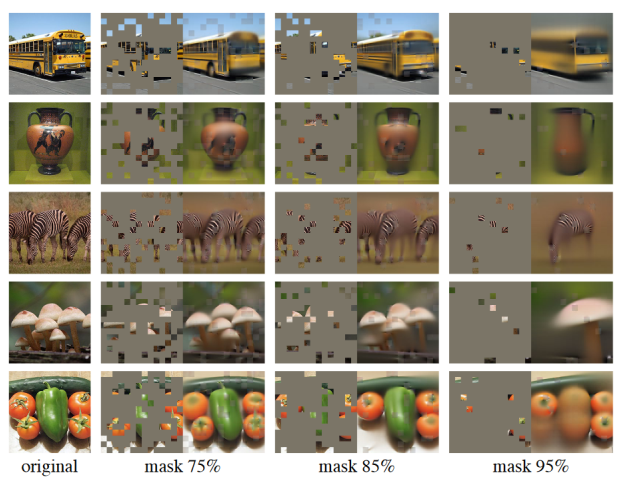
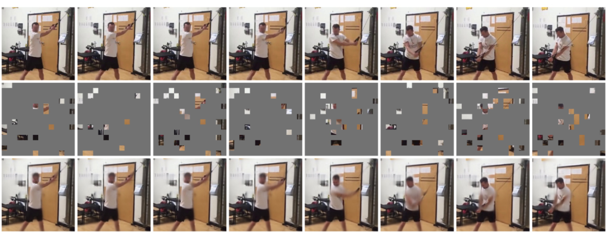
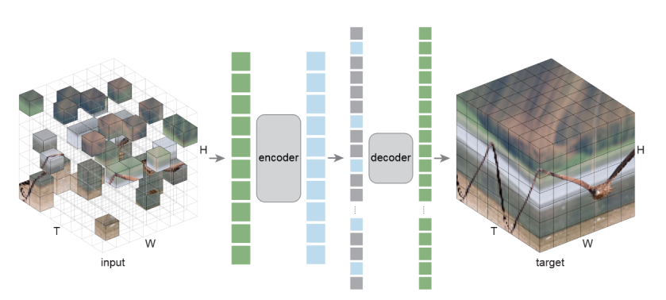
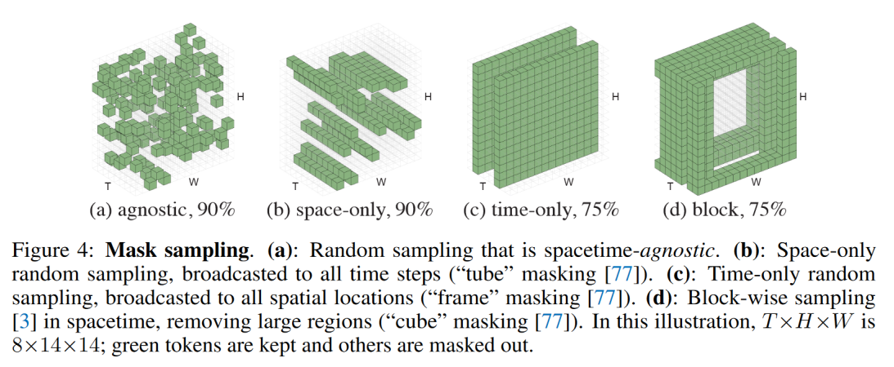
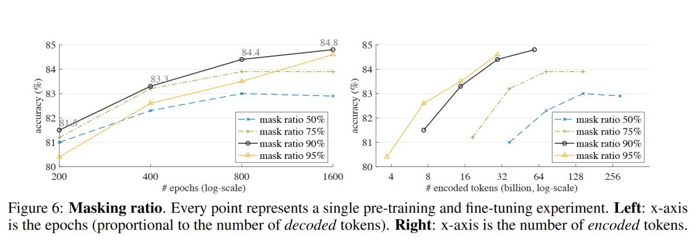
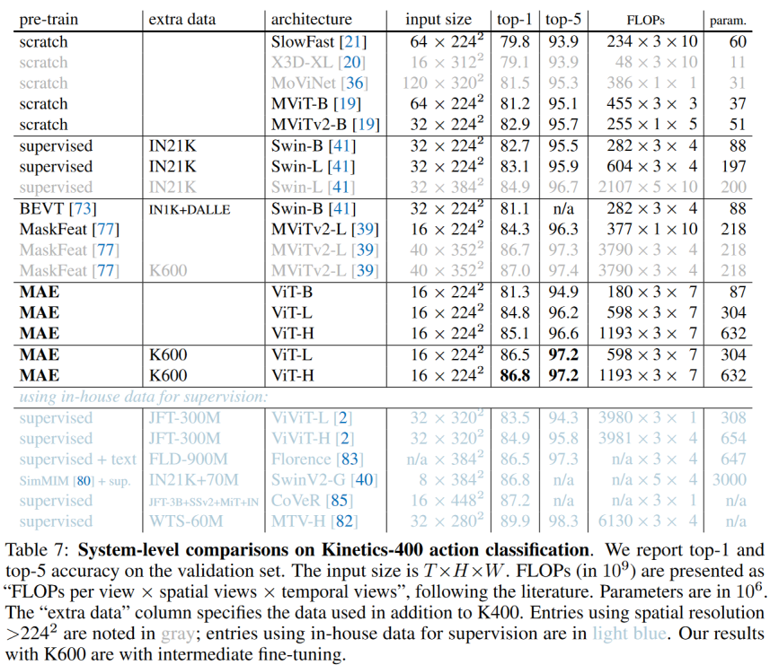

    Title: Masked Autoencoders As Spatiotemporal Learners

    Paper: https://arxiv.org/pdf/2205.09113.pdf

继MAE范式的成功之后，Kaiming组又将其用在了Video Understanding上，这是一个很新的工作，本阅读笔记是紧跟时代潮流并结合自身理解写成。全文的风格是一贯的详尽和清晰，一个简单的论点和难以反驳的实验报告。（可能也是128块V100的钞能力让人无法反驳吧

为了行文的简明扼要，本文默认以下概念是基础和无需解释的：
1. Self-Attention
2. Pre-training
3. Vision Transformer(ViT)
4. Encoder-Decoder
5. Inductive Bias

## Introduction

Masked Autoencoders是一种新兴的无监督预训练的范式，其核心思想是将输入的部分进行掩码，通过还原和重建掩码部分来达到预训练的结果。

> 比喻来说就是通过完型填空的方式进行阅读理解和语法语感的训练。

在自然语言处理(NLP)领域里，Bert采用这种范式取得了成功。在CV领域，MAE的实验证明在大约75%的掩码下图像也能被很好的还原出来。

那么在视频理解中，这个比例能达到多少呢，本文给出了答案：至少90%。

在语言领域，人需要充分结合上下文、语境、文化环境才能猜出一句话中需要被补全的单词。即使文字的序顺可能不影响阅读，但这样的填空还是需要大量的先验知识。文字的信息熵相对较高，冗余量较低，例如"I drink a cup of __ at night"就需要有额外的很多信息来预测，没有一句话是无用的。

相比于自然语言，视觉信号的表达是更加低秩、高冗余的。我们伟大的文学家鲁迅曾经说过：

> 一见短袖子，立刻想到白胳膊。

在像素层面，例如出现一个人的鞋，很自然的能补全成一条腿，进而是一个完整的人。这里我拿语言来叙述一个场景：

> 这幅画的天是蓝的，草是绿的。并且左下角的草是绿的，右下角的草是绿的，中间的草是绿的...

这从物理意义上压缩图片不同，我们事实上根本不需要如此多的信息去理解一张图片。在大比例的mask下，一张图片的信息可以被还原出来，我们可以看到在75%-85%的时候图像的重建还是效果不错的。还原出来的图像用来做classification已经是绰绰有余了。

自然地想到，在连续的时序图片构成的视频中，这个比例会进一步地被放大，其原因在于视频中帧间信息存在更大的冗余。除去视角切换和剧烈运动的情况，视频的背景几乎是不变的，而物体的运动也包含一定的规律，这就给信息压缩带来了很大的操作空间。本文针对这一假设，基于ViT设计了针对视频理解的范式。下图是在90%掩码下的重建效果，效果拔群。第一行是原视频，第二行是model的输入（原视频不输入），第三行是输出。

## Method

技术上十分简单，主要有两个讨论点：Patch Embedding和Masking。以下是整体流程，先掩码，再取样，后重建。

### Patch Embedding

取patch的策略和ViViT一致，没有对时空的注意力进行解耦的操作，直接规则地切分了三维的像素块作为patch（参照上图左右侧的网络。Encoder和Decoder操作都是纯纯的变形金刚block。注意到encoder部分只用有信息的部分来减少参数量。

### Masking

Mask的选取是一件很有讲究的事情。具体大致有下图几种做法：

在同一时期的另一个工作VideoMAE中使用tube masking, 并且认为采取这一种遮挡策略可以减少信息的泄露。而本文使用上图a)的打乱的随机掩码策略，上图明显是b-d更难而a更简单，这里需要展开讨论一下笔者的理解。

a的策略一个好处是可以减少inductive bias，而b-d成block的做法还是会存在这一偏差的。这种bias具体来说是错误的关注了数据中和标签因果不相干的部分。

> 举例，看到长头发就觉得是女孩子。

预训练，尤其是大规模的的一大核心就是要避免inductive bias，提升泛化性。

> 这里类比一下dropput层，是随机失活的。

a的第二个优点是对时空一致性的把握从直觉上更好。因为mask的密度相对均匀，每一个时空中都或多或少有一定碎片。

> 举例，这就好像把人脸遮住上半部分可能难认。但是如果打马赛克化成灰都能认识。

## Experiment

方法上是简单的，实验上是充分的。这里我们重点关注一下mask的ratio。

然后关注一下K400这个大dataset。

其他的实验参看原文，最后希望有朝一日大规模的预训练的范式能卷到video understanding领域来。