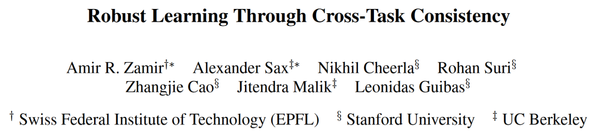

文章看不过来了，一些简单的就不写笔记了。这一篇关于多任务的是教科书级别的文章，值得反复诵读。

    title: Robust Learning Through Cross-Task Consistency
    paper: https://openaccess.thecvf.com/content_CVPR_2020/html/Zamir_Robust_Learning_Through_Cross-Task_Consistency_CVPR_2020_paper.html
    webcite: https://consistency.epfl.ch/ 

## Introduction

多任务学习一般的思路是通过互补的任务设计，能够更好的捕捉数据共有的特征、或者通过简单任务辅助困难任务收敛。常见的多任务学习框架在特征提取阶段共享一个层，而针对每个特定任务设计各自的层，这样的做法很难保证多恩个任务能协同工作。虽然已有一些手段利用不确定性来确定损失函数的权重关系，但任务间的关系仍不太明确。和多模态、多视角、多帧等多源数据类似，通过源与源之间的一致性来约束往往是一个好的手段。

## Method

### 最小一致性单元

我们考虑一个三角形为最小的一致性单元（图中b，由源输入$\mathcal{X}$和两个任务的输出$\mathcal{Y}_1,\mathcal{Y}_2$构成。直接同时训练两个任务比较困难，那么考虑任务间的映射关系$f_{\mathcal{Y}_1\mathcal{Y}_2}$，将总体损失相加，显然地有

$$
    \mathcal{L}_{\mathcal{X}\mathcal{Y}_1\mathcal{Y}_2}^{triangle} \triangleq |f_{\mathcal{X}\mathcal{Y}_1}(x)-y_1| + |f_{\mathcal{X}\mathcal{Y}_2}(x)-y_2| \\
    + |f_{\mathcal{Y}_1\mathcal{Y}_2}\circ f_{\mathcal{X}\mathcal{Y}_1}(x)-f_{\mathcal{X}\mathcal{Y}_2}(x)|
$$

原文中在separate和perceptual两个方向做了优化，公式量有点大但思路并不复杂。separeate指下图b，perceptua指下图c，优化的方向是通过更换输入变量和考虑容易收敛的函数形式。

### 路径的可加性和不变性

考虑了一个最小的三角单元之后，我们把目光看向图的构造形式。这里做了一个重要的假设，就是任意的几条映射路径只要始终点一致，结果都应该保持一致。最后的形式如上图d中显示，考虑一个直接的映射到$\mathcal{Y}_1$，然后其作为基底形成新的逐步映射。

### 全局的优化目标

框架的目标是不断地寻找更长的链路来达到一致性优化。

### 能量一致性

对于一个输入和一些映射的输出，定义跨节点的非一致性损失经过归一分布后的和为能量一致性。这个定义只是用来说明优化的效果（代替一般的损失函数值。

### 在无监督工作中使用一致性

本文认为这一框架不仅适用于多任务学习，对于单任务学习，可以设计一些无监督的辅助任务来进行同样的约束效果（比如边缘）。