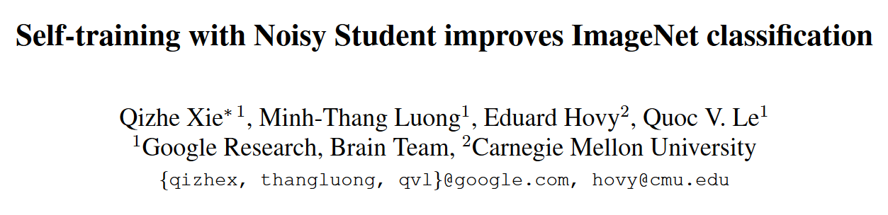
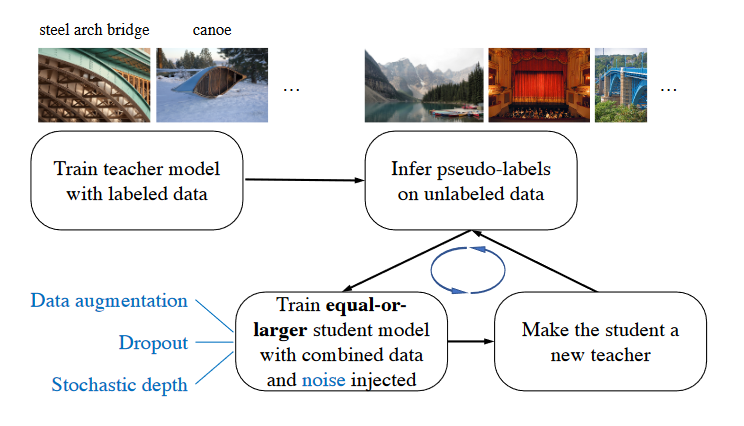
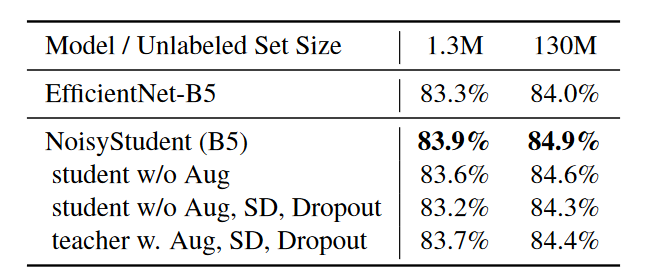

## Introduction

Self-training with Noisy Student improves ImageNet classification

任务是什么？

有一个labeled source domain，一个unlabeled target domain，在半监督的setting下完成对后者的泛化。

## Method

方法是什么？

有监督的预训练一个teacher model，使用其对无标注的图像打soft/hard的伪标签，以伪标签和部分有标签的图像组合训练自身。

需要关注的点？

1. 使用stochastic depth, dropout, and RandAugment to noise the student. 噪声的作用是 improvements from using noise can be resulted from preventing overfitting the pseudo labels on the unlabeled images.

2. soft/hard label

都可以，soft属于知识蒸馏，效果会略好一些。

3. 标注和未标注的比例，以及为什么要混合标注。

1：3；混合标注是为了不让最优解滑走。