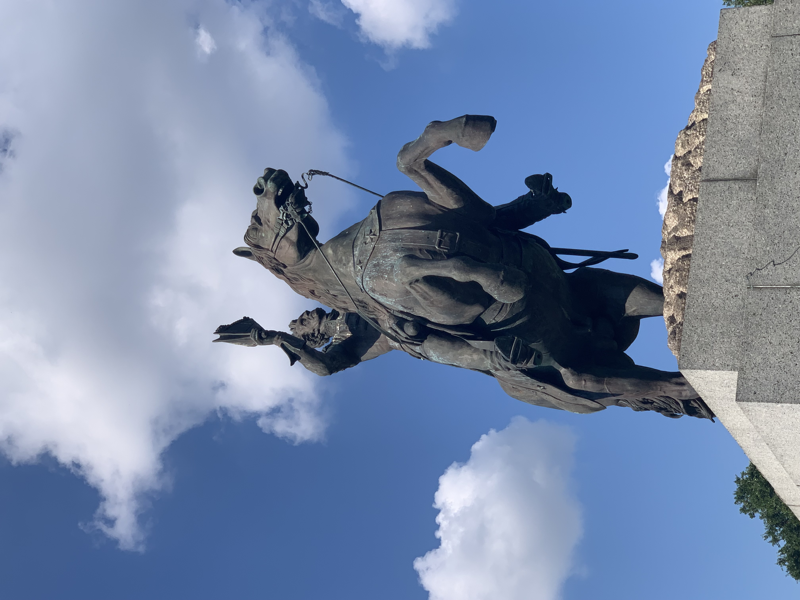
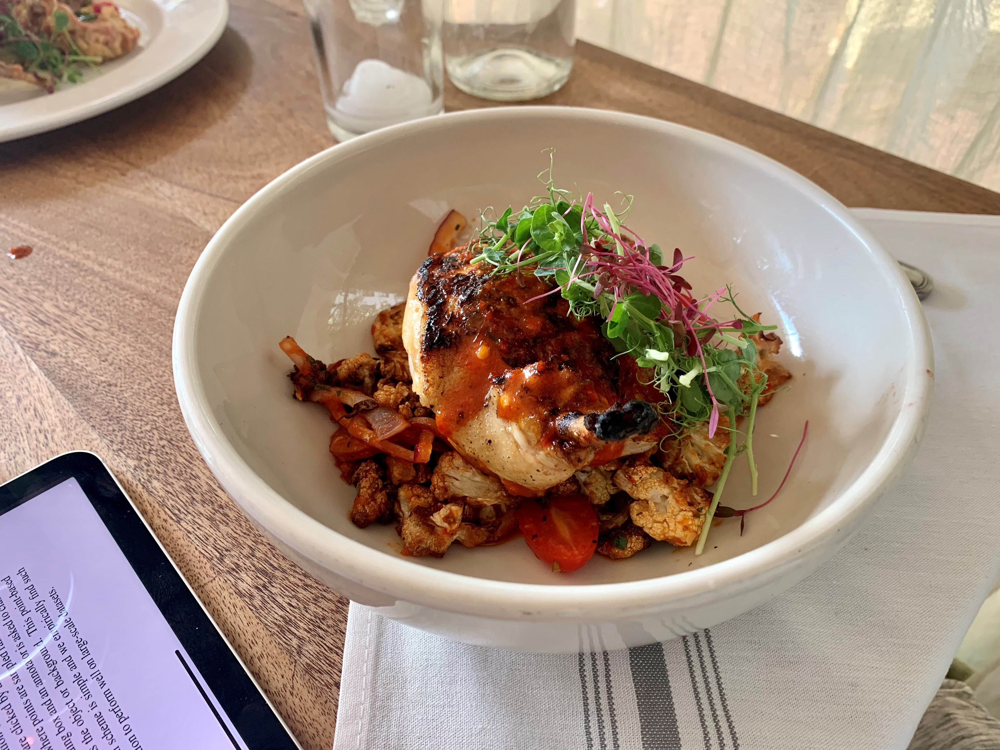

In most Chinese people's stereotypes, New Orleans is famous for its grilled chicken flavor. However, Cajun dishes and seafood, including gumbo, etouffee, crawfish, oyster, gumbo, po'boy, and jambalaya, are the authentic signature indeed. Beyond delicacy, New Orleans was fought over by the United States, Britain, and France hundreds of years ago. Andrew Jackson became the 7th U.S. President partly because of this city, and there is a memorial square here.

About CVPR 2022, it's my first time to attend such a top conference in person, especially as an undergraduate. I got a lot with two-day workshop and four-day main conference. I shared my notes and paper list I following at [GitHub](https://github.com/Reself-C/awesome-cvpr2022). If you like it, you can take it.

Thanks to the researchers having the same interests as me for sharing the ideas. Thanks to the friends in the industry, including Google, Meta, Microsoft, and Kitware. Thanks to the professor of universities. Special thanks to Prof. Dr. Angela Dai for the discussion about 3D vision. Special thanks to Dr. Andrea Tagliasacchi for sharing a residency opportunity in Google.

I realized that I had accumulated some knowledge, and the next step was to put it into practice. Write the idea into a paper. It's no necessary to apply for Ph.D. now since I don't really know what I want the most. Although turning 21 next month, I'm looking towards my 28th.