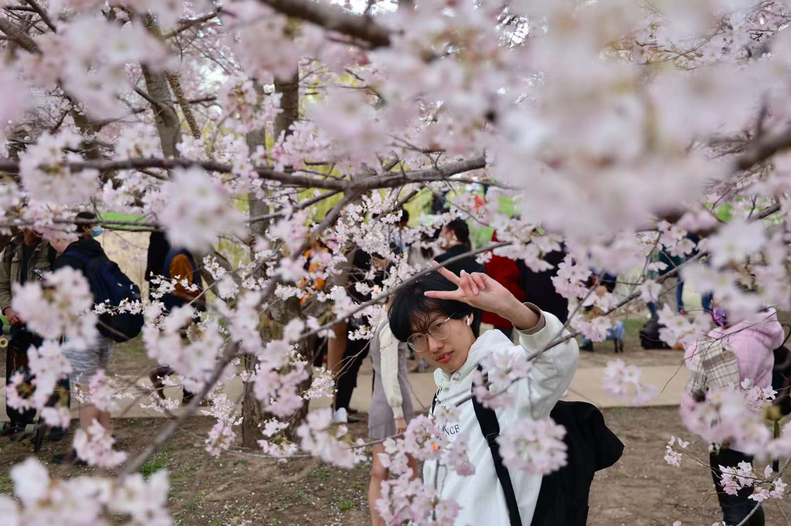

## Who am I

I am a junior undergraduate student at Zhejiang University and the University of Illinois Urbana-Champaign, majoring in Civil Engineering. I am preparing to apply for a Master or PhD in Computer Science, especially in the area of Machine Learning.

## How to call me

"Wenhao" is my first name and "Chai" is my last name. "Reself" is the commonly used English name that is not part of my legal name. The word re-self is a combination of the prefix "Re" and the suffix "Self". It holds the expectation that I will have the courage to re-examine myself after much experience.

## What I am interested in

In terms of research, my interests are mainly in `Computer Vision`, which is an important area under artificial intelligence and deep learning. Specifically, I am involved in the `3D Human Pose Estimation`, `Multimodal Learning`, `Video Object Segmentation`, `Domain Adaptation`, `Human Action Recognition`, and other aspects of it.

In other respects, I am a photography enthusiast, but a novice. For life, I used to write some essays in Chinese to express my attitude. I am full of desire and romance in life, even if I am very busy, I will still go and insist on finishing what I want to do. I am currently single, but looking forward to an ideal love.